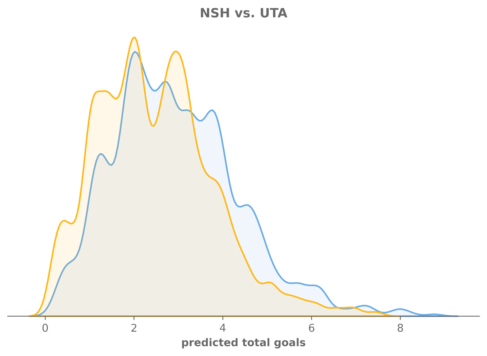
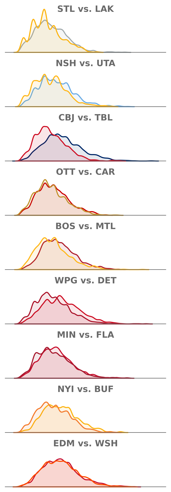

# Simulating today’s hockey games
chicken
2026-01-27

<!-- WARNING: THIS FILE WAS AUTOGENERATED! DO NOT EDIT! -->

## **Intro**

Use the `chickenstats` library to scrape play-by-play data, aggregate to
the team level, then run monte carlo simulations to predict the winners
of today’s games.

Parts of this tutorial are optional and will be clearly marked as such.
For help, or any questions, please don’t hesitate to reach out to
<chicken@chickenandstats.com> or
[@chickenandstats.com](https://bsky.app/profile/chickenandstats.com) on
Blue Sky.

------------------------------------------------------------------------


------------------------------------------------------------------------

## **Housekeeping**

### Import dependencies

Import the dependencies we’ll need for the guide

``` python
import matplotlib.pyplot as plt
import seaborn as sns

import polars as pl

from pathlib import Path
import datetime as dt


from chickenstats.chicken_nhl import Scraper, Season
from chickenstats.chicken_nhl._helpers import charts_directory
from chickenstats.chicken_nhl.team import NHL_COLORS

from monte_carlo import (
    aggregate_strength_states,
    prep_nhl_stats,
    prep_team_stats,
    prep_todays_games,
    simulate_game,
    predict_game,
    predict_games,
    process_winners,
    assess_predictions,
)
```

### Polars options

Set different polars options. This cell is optional

``` python
pl.Config.set_tbl_cols(-1)
```

    polars.config.Config

### Folder structure

``` python
charts_directory()
```

### Chickenstats matplotlib style

chickenstats.utilities includes a custom style package - this activates
it. This cell is also optional

``` python
plt.style.use("chickenstats")
```

------------------------------------------------------------------------

## **Scrape data**

### Schedule

Scrape the schedule using the `Season` object

``` python
season = Season(2025, backend="polars")
```

``` python
schedule = season.schedule()
```

    Output()

<pre style="white-space:pre;overflow-x:auto;line-height:normal;font-family:Menlo,'DejaVu Sans Mono',consolas,'Courier New',monospace"></pre>

### Standings and team names

Scrape the standings and create team name dictionaries to use later

``` python
standings = season.standings
```

``` python
standings.head(5)
```

<div><style>
.dataframe > thead > tr,
.dataframe > tbody > tr {
  text-align: right;
  white-space: pre-wrap;
}
</style>
<small>shape: (5, 57)</small>

<table class="dataframe" data-quarto-postprocess="true" data-border="1">
<thead>
<tr>
<th data-quarto-table-cell-role="th">season</th>
<th data-quarto-table-cell-role="th">date</th>
<th data-quarto-table-cell-role="th">team</th>
<th data-quarto-table-cell-role="th">team_name</th>
<th data-quarto-table-cell-role="th">conference</th>
<th data-quarto-table-cell-role="th">division</th>
<th data-quarto-table-cell-role="th">games_played</th>
<th data-quarto-table-cell-role="th">points</th>
<th data-quarto-table-cell-role="th">points_pct</th>
<th data-quarto-table-cell-role="th">wins</th>
<th data-quarto-table-cell-role="th">regulation_wins</th>
<th data-quarto-table-cell-role="th">shootout_wins</th>
<th data-quarto-table-cell-role="th">losses</th>
<th data-quarto-table-cell-role="th">ot_losses</th>
<th data-quarto-table-cell-role="th">shootout_losses</th>
<th data-quarto-table-cell-role="th">ties</th>
<th data-quarto-table-cell-role="th">win_pct</th>
<th data-quarto-table-cell-role="th">regulation_win_pct</th>
<th data-quarto-table-cell-role="th">streak_code</th>
<th data-quarto-table-cell-role="th">streak_count</th>
<th data-quarto-table-cell-role="th">goals_for</th>
<th data-quarto-table-cell-role="th">goals_against</th>
<th data-quarto-table-cell-role="th">goals_for_pct</th>
<th data-quarto-table-cell-role="th">goal_differential</th>
<th data-quarto-table-cell-role="th">goal_differential_pct</th>
<th data-quarto-table-cell-role="th">home_games_played</th>
<th data-quarto-table-cell-role="th">home_points</th>
<th data-quarto-table-cell-role="th">home_goals_for</th>
<th data-quarto-table-cell-role="th">home_goals_against</th>
<th data-quarto-table-cell-role="th">home_goal_differential</th>
<th data-quarto-table-cell-role="th">home_wins</th>
<th data-quarto-table-cell-role="th">home_losses</th>
<th data-quarto-table-cell-role="th">home_ot_losses</th>
<th data-quarto-table-cell-role="th">home_ties</th>
<th data-quarto-table-cell-role="th">home_regulation_wins</th>
<th data-quarto-table-cell-role="th">road_games_played</th>
<th data-quarto-table-cell-role="th">road_points</th>
<th data-quarto-table-cell-role="th">road_goals_for</th>
<th data-quarto-table-cell-role="th">road_goals_against</th>
<th data-quarto-table-cell-role="th">road_goal_differential</th>
<th data-quarto-table-cell-role="th">road_wins</th>
<th data-quarto-table-cell-role="th">road_losses</th>
<th data-quarto-table-cell-role="th">road_ot_losses</th>
<th data-quarto-table-cell-role="th">road_ties</th>
<th data-quarto-table-cell-role="th">road_regulation_wins</th>
<th data-quarto-table-cell-role="th">l10_points</th>
<th data-quarto-table-cell-role="th">l10_goals_for</th>
<th data-quarto-table-cell-role="th">l10_goals_against</th>
<th data-quarto-table-cell-role="th">l10_goal_differential</th>
<th data-quarto-table-cell-role="th">l10_wins</th>
<th data-quarto-table-cell-role="th">l10_losses</th>
<th data-quarto-table-cell-role="th">l10_ot_losses</th>
<th data-quarto-table-cell-role="th">l10_ties</th>
<th data-quarto-table-cell-role="th">l10_regulation_wins</th>
<th data-quarto-table-cell-role="th">team_logo</th>
<th data-quarto-table-cell-role="th">wildcard_sequence</th>
<th data-quarto-table-cell-role="th">waivers_sequence</th>
</tr>
<tr>
<th>i64</th>
<th>str</th>
<th>str</th>
<th>str</th>
<th>str</th>
<th>str</th>
<th>i64</th>
<th>i64</th>
<th>f64</th>
<th>i64</th>
<th>i64</th>
<th>i64</th>
<th>i64</th>
<th>i64</th>
<th>i64</th>
<th>i64</th>
<th>f64</th>
<th>f64</th>
<th>str</th>
<th>i64</th>
<th>i64</th>
<th>i64</th>
<th>f64</th>
<th>i64</th>
<th>f64</th>
<th>i64</th>
<th>i64</th>
<th>i64</th>
<th>i64</th>
<th>i64</th>
<th>i64</th>
<th>i64</th>
<th>i64</th>
<th>i64</th>
<th>i64</th>
<th>i64</th>
<th>i64</th>
<th>i64</th>
<th>i64</th>
<th>i64</th>
<th>i64</th>
<th>i64</th>
<th>i64</th>
<th>i64</th>
<th>i64</th>
<th>i64</th>
<th>i64</th>
<th>i64</th>
<th>i64</th>
<th>i64</th>
<th>i64</th>
<th>i64</th>
<th>i64</th>
<th>i64</th>
<th>str</th>
<th>i64</th>
<th>i64</th>
</tr>
</thead>
<tbody>
<tr>
<td>20252026</td>
<td>"2026-03-15"</td>
<td>"COL"</td>
<td>"Colorado Avalanche"</td>
<td>"Western"</td>
<td>"Central"</td>
<td>65</td>
<td>97</td>
<td>0.746154</td>
<td>44</td>
<td>39</td>
<td>3</td>
<td>12</td>
<td>9</td>
<td>null</td>
<td>0</td>
<td>0.676923</td>
<td>0.6</td>
<td>"L"</td>
<td>1</td>
<td>247</td>
<td>163</td>
<td>3.8</td>
<td>84</td>
<td>1.292308</td>
<td>32</td>
<td>50</td>
<td>128</td>
<td>78</td>
<td>50</td>
<td>23</td>
<td>5</td>
<td>4</td>
<td>0</td>
<td>22</td>
<td>33</td>
<td>47</td>
<td>119</td>
<td>85</td>
<td>34</td>
<td>21</td>
<td>7</td>
<td>5</td>
<td>0</td>
<td>17</td>
<td>14</td>
<td>35</td>
<td>25</td>
<td>10</td>
<td>7</td>
<td>3</td>
<td>0</td>
<td>0</td>
<td>5</td>
<td>"https://assets.nhle.com/logos/…</td>
<td>0</td>
<td>32</td>
</tr>
<tr>
<td>20252026</td>
<td>"2026-03-15"</td>
<td>"DAL"</td>
<td>"Dallas Stars"</td>
<td>"Western"</td>
<td>"Central"</td>
<td>66</td>
<td>94</td>
<td>0.712121</td>
<td>42</td>
<td>33</td>
<td>4</td>
<td>14</td>
<td>10</td>
<td>null</td>
<td>0</td>
<td>0.636364</td>
<td>0.5</td>
<td>"W"</td>
<td>4</td>
<td>232</td>
<td>178</td>
<td>3.515152</td>
<td>54</td>
<td>0.818182</td>
<td>33</td>
<td>48</td>
<td>112</td>
<td>88</td>
<td>24</td>
<td>22</td>
<td>7</td>
<td>4</td>
<td>0</td>
<td>16</td>
<td>33</td>
<td>46</td>
<td>120</td>
<td>90</td>
<td>30</td>
<td>20</td>
<td>7</td>
<td>6</td>
<td>0</td>
<td>17</td>
<td>19</td>
<td>44</td>
<td>22</td>
<td>22</td>
<td>9</td>
<td>0</td>
<td>1</td>
<td>0</td>
<td>6</td>
<td>"https://assets.nhle.com/logos/…</td>
<td>0</td>
<td>31</td>
</tr>
<tr>
<td>20252026</td>
<td>"2026-03-15"</td>
<td>"CAR"</td>
<td>"Carolina Hurricanes"</td>
<td>"Eastern"</td>
<td>"Metropolitan"</td>
<td>66</td>
<td>90</td>
<td>0.681818</td>
<td>42</td>
<td>31</td>
<td>5</td>
<td>18</td>
<td>6</td>
<td>null</td>
<td>0</td>
<td>0.636364</td>
<td>0.469697</td>
<td>"W"</td>
<td>1</td>
<td>234</td>
<td>192</td>
<td>3.545455</td>
<td>42</td>
<td>0.636364</td>
<td>35</td>
<td>50</td>
<td>134</td>
<td>107</td>
<td>27</td>
<td>24</td>
<td>9</td>
<td>2</td>
<td>0</td>
<td>17</td>
<td>31</td>
<td>40</td>
<td>100</td>
<td>85</td>
<td>15</td>
<td>18</td>
<td>9</td>
<td>4</td>
<td>0</td>
<td>14</td>
<td>14</td>
<td>39</td>
<td>29</td>
<td>10</td>
<td>7</td>
<td>3</td>
<td>0</td>
<td>0</td>
<td>6</td>
<td>"https://assets.nhle.com/logos/…</td>
<td>0</td>
<td>30</td>
</tr>
<tr>
<td>20252026</td>
<td>"2026-03-15"</td>
<td>"BUF"</td>
<td>"Buffalo Sabres"</td>
<td>"Eastern"</td>
<td>"Atlantic"</td>
<td>67</td>
<td>88</td>
<td>0.656716</td>
<td>41</td>
<td>34</td>
<td>4</td>
<td>20</td>
<td>6</td>
<td>null</td>
<td>0</td>
<td>0.61194</td>
<td>0.507463</td>
<td>"W"</td>
<td>1</td>
<td>235</td>
<td>200</td>
<td>3.507463</td>
<td>35</td>
<td>0.522388</td>
<td>34</td>
<td>47</td>
<td>125</td>
<td>99</td>
<td>26</td>
<td>22</td>
<td>9</td>
<td>3</td>
<td>0</td>
<td>19</td>
<td>33</td>
<td>41</td>
<td>110</td>
<td>101</td>
<td>9</td>
<td>19</td>
<td>11</td>
<td>3</td>
<td>0</td>
<td>15</td>
<td>18</td>
<td>40</td>
<td>24</td>
<td>16</td>
<td>9</td>
<td>1</td>
<td>0</td>
<td>0</td>
<td>8</td>
<td>"https://assets.nhle.com/logos/…</td>
<td>0</td>
<td>29</td>
</tr>
<tr>
<td>20252026</td>
<td>"2026-03-15"</td>
<td>"MIN"</td>
<td>"Minnesota Wild"</td>
<td>"Western"</td>
<td>"Central"</td>
<td>67</td>
<td>88</td>
<td>0.656716</td>
<td>38</td>
<td>25</td>
<td>4</td>
<td>17</td>
<td>12</td>
<td>null</td>
<td>0</td>
<td>0.567164</td>
<td>0.373134</td>
<td>"L"</td>
<td>1</td>
<td>224</td>
<td>192</td>
<td>3.343284</td>
<td>32</td>
<td>0.477612</td>
<td>35</td>
<td>46</td>
<td>112</td>
<td>102</td>
<td>10</td>
<td>19</td>
<td>8</td>
<td>8</td>
<td>0</td>
<td>11</td>
<td>32</td>
<td>42</td>
<td>112</td>
<td>90</td>
<td>22</td>
<td>19</td>
<td>9</td>
<td>4</td>
<td>0</td>
<td>14</td>
<td>12</td>
<td>34</td>
<td>28</td>
<td>6</td>
<td>5</td>
<td>3</td>
<td>2</td>
<td>0</td>
<td>4</td>
<td>"https://assets.nhle.com/logos/…</td>
<td>0</td>
<td>28</td>
</tr>
</tbody>
</table>

</div>

``` python
team_names = standings.sort(by="team_name")["team_name"].str.to_uppercase().to_list()
team_codes = standings.sort(by="team_name")["team"].str.to_uppercase().to_list()
team_names_dict = dict(zip(team_codes, team_names, strict=False))

home_teams = dict(zip(schedule["game_id"].to_list(), schedule["home_team"].to_list(), strict=False))
```

### Game IDs

Create a list of game IDs to scrape

``` python
conds = pl.col("game_state") == "OFF"

game_ids = schedule.filter(conds)["game_id"].unique().to_list()
```

### Latest date

Important! If you don’t set this, it will just pull from the last
completed game

``` python
conds = pl.col("game_state") == "OFF"

dt_format = "%Y-%m-%d"
latest_date_dt = schedule.filter(conds)["game_date"].str.to_datetime(format=dt_format).max()  # In YYYY-MM-DD format
latest_date = latest_date_dt.strftime(dt_format)

latest_date = "2026-01-24"
latest_date_dt = dt.date(year=int(latest_date[:4]), month=int(latest_date[5:7]), day=int(latest_date[8:10]))
```

### Checking to see if you’ve already scraped the data

Check to see if you’ve already scraped, so you’re only getting the
game_ids that you need

``` python
data_directory = Path.cwd() / "data"
stats_file = data_directory / "team_stats.csv"

if not data_directory.exists():
    data_directory.mkdir()

if stats_file.exists():
    team_stats = pl.read_csv(source=stats_file, infer_schema_length=2000)

    saved_game_ids = team_stats["game_id"].to_list()
    game_ids = [x for x in game_ids if x not in saved_game_ids]
```

``` python
if game_ids:
    scraper = Scraper(game_ids, backend="polars")

    pbp = scraper.play_by_play
    scraped_team_stats = scraper.team_stats
```

    Output()

<pre style="white-space:pre;overflow-x:auto;line-height:normal;font-family:Menlo,'DejaVu Sans Mono',consolas,'Courier New',monospace"></pre>

    Output()

<pre style="white-space:pre;overflow-x:auto;line-height:normal;font-family:Menlo,'DejaVu Sans Mono',consolas,'Courier New',monospace"></pre>

### Combine scraped and saved data

Combine the scraped data and the saved data, then save the new file, but
only if there are game_ids

``` python
if game_ids:
    team_stats = pl.concat(
        [team_stats.with_columns(pl.col("bsf_adj_percent").cast(pl.Float64)), scraped_team_stats], strict=False
    )  # Quick, don't ask
    team_stats.write_csv(stats_file)
```

``` python
team_stats.head(5)
```

<div><style>
.dataframe > thead > tr,
.dataframe > tbody > tr {
  text-align: right;
  white-space: pre-wrap;
}
</style>
<small>shape: (5, 141)</small>

<table class="dataframe" data-quarto-postprocess="true" data-border="1">
<thead>
<tr>
<th data-quarto-table-cell-role="th">season</th>
<th data-quarto-table-cell-role="th">session</th>
<th data-quarto-table-cell-role="th">game_id</th>
<th data-quarto-table-cell-role="th">game_date</th>
<th data-quarto-table-cell-role="th">team</th>
<th data-quarto-table-cell-role="th">opp_team</th>
<th data-quarto-table-cell-role="th">strength_state</th>
<th data-quarto-table-cell-role="th">toi</th>
<th data-quarto-table-cell-role="th">gf</th>
<th data-quarto-table-cell-role="th">ga</th>
<th data-quarto-table-cell-role="th">gf_adj</th>
<th data-quarto-table-cell-role="th">ga_adj</th>
<th data-quarto-table-cell-role="th">hdgf</th>
<th data-quarto-table-cell-role="th">hdga</th>
<th data-quarto-table-cell-role="th">xgf</th>
<th data-quarto-table-cell-role="th">xga</th>
<th data-quarto-table-cell-role="th">xgf_adj</th>
<th data-quarto-table-cell-role="th">xga_adj</th>
<th data-quarto-table-cell-role="th">sf</th>
<th data-quarto-table-cell-role="th">sa</th>
<th data-quarto-table-cell-role="th">sf_adj</th>
<th data-quarto-table-cell-role="th">sa_adj</th>
<th data-quarto-table-cell-role="th">hdsf</th>
<th data-quarto-table-cell-role="th">hdsa</th>
<th data-quarto-table-cell-role="th">ff</th>
<th data-quarto-table-cell-role="th">fa</th>
<th data-quarto-table-cell-role="th">ff_adj</th>
<th data-quarto-table-cell-role="th">fa_adj</th>
<th data-quarto-table-cell-role="th">hdff</th>
<th data-quarto-table-cell-role="th">hdfa</th>
<th data-quarto-table-cell-role="th">cf</th>
<th data-quarto-table-cell-role="th">ca</th>
<th data-quarto-table-cell-role="th">cf_adj</th>
<th data-quarto-table-cell-role="th">ca_adj</th>
<th data-quarto-table-cell-role="th">bsf</th>
<th data-quarto-table-cell-role="th">bsa</th>
<th data-quarto-table-cell-role="th">bsf_adj</th>
<th data-quarto-table-cell-role="th">bsa_adj</th>
<th data-quarto-table-cell-role="th">msf</th>
<th data-quarto-table-cell-role="th">msa</th>
<th data-quarto-table-cell-role="th">msf_adj</th>
<th data-quarto-table-cell-role="th">msa_adj</th>
<th data-quarto-table-cell-role="th">hdmsf</th>
<th data-quarto-table-cell-role="th">hdmsa</th>
<th data-quarto-table-cell-role="th">teammate_block</th>
<th data-quarto-table-cell-role="th">hf</th>
<th data-quarto-table-cell-role="th">ht</th>
<th data-quarto-table-cell-role="th">give</th>
<th data-quarto-table-cell-role="th">take</th>
<th data-quarto-table-cell-role="th">ozf</th>
<th data-quarto-table-cell-role="th">nzf</th>
<th data-quarto-table-cell-role="th">dzf</th>
<th data-quarto-table-cell-role="th">fow</th>
<th data-quarto-table-cell-role="th">fol</th>
<th data-quarto-table-cell-role="th">ozfw</th>
<th data-quarto-table-cell-role="th">ozfl</th>
<th data-quarto-table-cell-role="th">nzfw</th>
<th data-quarto-table-cell-role="th">nzfl</th>
<th data-quarto-table-cell-role="th">dzfw</th>
<th data-quarto-table-cell-role="th">dzfl</th>
<th data-quarto-table-cell-role="th">pent0</th>
<th data-quarto-table-cell-role="th">pent2</th>
<th data-quarto-table-cell-role="th">pent4</th>
<th data-quarto-table-cell-role="th">pent5</th>
<th data-quarto-table-cell-role="th">pent10</th>
<th data-quarto-table-cell-role="th">pend0</th>
<th data-quarto-table-cell-role="th">pend2</th>
<th data-quarto-table-cell-role="th">pend4</th>
<th data-quarto-table-cell-role="th">pend5</th>
<th data-quarto-table-cell-role="th">pend10</th>
<th data-quarto-table-cell-role="th">gf_p60</th>
<th data-quarto-table-cell-role="th">ga_p60</th>
<th data-quarto-table-cell-role="th">gf_adj_p60</th>
<th data-quarto-table-cell-role="th">ga_adj_p60</th>
<th data-quarto-table-cell-role="th">hdgf_p60</th>
<th data-quarto-table-cell-role="th">hdga_p60</th>
<th data-quarto-table-cell-role="th">xgf_p60</th>
<th data-quarto-table-cell-role="th">xga_p60</th>
<th data-quarto-table-cell-role="th">xgf_adj_p60</th>
<th data-quarto-table-cell-role="th">xga_adj_p60</th>
<th data-quarto-table-cell-role="th">sf_p60</th>
<th data-quarto-table-cell-role="th">sa_p60</th>
<th data-quarto-table-cell-role="th">sf_adj_p60</th>
<th data-quarto-table-cell-role="th">sa_adj_p60</th>
<th data-quarto-table-cell-role="th">hdsf_p60</th>
<th data-quarto-table-cell-role="th">hdsa_p60</th>
<th data-quarto-table-cell-role="th">ff_p60</th>
<th data-quarto-table-cell-role="th">fa_p60</th>
<th data-quarto-table-cell-role="th">ff_adj_p60</th>
<th data-quarto-table-cell-role="th">fa_adj_p60</th>
<th data-quarto-table-cell-role="th">hdff_p60</th>
<th data-quarto-table-cell-role="th">hdfa_p60</th>
<th data-quarto-table-cell-role="th">cf_p60</th>
<th data-quarto-table-cell-role="th">ca_p60</th>
<th data-quarto-table-cell-role="th">cf_adj_p60</th>
<th data-quarto-table-cell-role="th">ca_adj_p60</th>
<th data-quarto-table-cell-role="th">bsf_p60</th>
<th data-quarto-table-cell-role="th">bsa_p60</th>
<th data-quarto-table-cell-role="th">bsf_adj_p60</th>
<th data-quarto-table-cell-role="th">bsa_adj_p60</th>
<th data-quarto-table-cell-role="th">msf_p60</th>
<th data-quarto-table-cell-role="th">msa_p60</th>
<th data-quarto-table-cell-role="th">msf_adj_p60</th>
<th data-quarto-table-cell-role="th">msa_adj_p60</th>
<th data-quarto-table-cell-role="th">hdmsf_p60</th>
<th data-quarto-table-cell-role="th">hdmsa_p60</th>
<th data-quarto-table-cell-role="th">teammate_block_p60</th>
<th data-quarto-table-cell-role="th">hf_p60</th>
<th data-quarto-table-cell-role="th">ht_p60</th>
<th data-quarto-table-cell-role="th">give_p60</th>
<th data-quarto-table-cell-role="th">take_p60</th>
<th data-quarto-table-cell-role="th">pent0_p60</th>
<th data-quarto-table-cell-role="th">pent2_p60</th>
<th data-quarto-table-cell-role="th">pent4_p60</th>
<th data-quarto-table-cell-role="th">pent5_p60</th>
<th data-quarto-table-cell-role="th">pent10_p60</th>
<th data-quarto-table-cell-role="th">pend0_p60</th>
<th data-quarto-table-cell-role="th">pend2_p60</th>
<th data-quarto-table-cell-role="th">pend4_p60</th>
<th data-quarto-table-cell-role="th">pend5_p60</th>
<th data-quarto-table-cell-role="th">pend10_p60</th>
<th data-quarto-table-cell-role="th">gf_percent</th>
<th data-quarto-table-cell-role="th">gf_adj_percent</th>
<th data-quarto-table-cell-role="th">hdgf_percent</th>
<th data-quarto-table-cell-role="th">xgf_percent</th>
<th data-quarto-table-cell-role="th">xgf_adj_percent</th>
<th data-quarto-table-cell-role="th">sf_percent</th>
<th data-quarto-table-cell-role="th">sf_adj_percent</th>
<th data-quarto-table-cell-role="th">hdsf_percent</th>
<th data-quarto-table-cell-role="th">ff_percent</th>
<th data-quarto-table-cell-role="th">ff_adj_percent</th>
<th data-quarto-table-cell-role="th">hdff_percent</th>
<th data-quarto-table-cell-role="th">cf_percent</th>
<th data-quarto-table-cell-role="th">cf_adj_percent</th>
<th data-quarto-table-cell-role="th">bsf_percent</th>
<th data-quarto-table-cell-role="th">bsf_adj_percent</th>
<th data-quarto-table-cell-role="th">msf_percent</th>
<th data-quarto-table-cell-role="th">msf_adj_percent</th>
<th data-quarto-table-cell-role="th">hdmsf_percent</th>
<th data-quarto-table-cell-role="th">hf_percent</th>
<th data-quarto-table-cell-role="th">take_percent</th>
</tr>
<tr>
<th>i64</th>
<th>str</th>
<th>i64</th>
<th>str</th>
<th>str</th>
<th>str</th>
<th>str</th>
<th>f64</th>
<th>i64</th>
<th>i64</th>
<th>f64</th>
<th>f64</th>
<th>i64</th>
<th>i64</th>
<th>f64</th>
<th>f64</th>
<th>f64</th>
<th>f64</th>
<th>i64</th>
<th>i64</th>
<th>f64</th>
<th>f64</th>
<th>i64</th>
<th>i64</th>
<th>i64</th>
<th>i64</th>
<th>f64</th>
<th>f64</th>
<th>i64</th>
<th>i64</th>
<th>i64</th>
<th>i64</th>
<th>f64</th>
<th>f64</th>
<th>i64</th>
<th>i64</th>
<th>f64</th>
<th>f64</th>
<th>i64</th>
<th>i64</th>
<th>f64</th>
<th>f64</th>
<th>i64</th>
<th>i64</th>
<th>i64</th>
<th>i64</th>
<th>i64</th>
<th>i64</th>
<th>i64</th>
<th>i64</th>
<th>i64</th>
<th>i64</th>
<th>i64</th>
<th>i64</th>
<th>i64</th>
<th>i64</th>
<th>i64</th>
<th>i64</th>
<th>i64</th>
<th>i64</th>
<th>i64</th>
<th>i64</th>
<th>i64</th>
<th>i64</th>
<th>i64</th>
<th>i64</th>
<th>i64</th>
<th>i64</th>
<th>i64</th>
<th>i64</th>
<th>f64</th>
<th>f64</th>
<th>f64</th>
<th>f64</th>
<th>f64</th>
<th>f64</th>
<th>f64</th>
<th>f64</th>
<th>f64</th>
<th>f64</th>
<th>f64</th>
<th>f64</th>
<th>f64</th>
<th>f64</th>
<th>f64</th>
<th>f64</th>
<th>f64</th>
<th>f64</th>
<th>f64</th>
<th>f64</th>
<th>f64</th>
<th>f64</th>
<th>f64</th>
<th>f64</th>
<th>f64</th>
<th>f64</th>
<th>f64</th>
<th>f64</th>
<th>f64</th>
<th>f64</th>
<th>f64</th>
<th>f64</th>
<th>f64</th>
<th>f64</th>
<th>f64</th>
<th>f64</th>
<th>f64</th>
<th>f64</th>
<th>f64</th>
<th>f64</th>
<th>f64</th>
<th>f64</th>
<th>f64</th>
<th>f64</th>
<th>f64</th>
<th>f64</th>
<th>f64</th>
<th>f64</th>
<th>f64</th>
<th>f64</th>
<th>f64</th>
<th>f64</th>
<th>f64</th>
<th>f64</th>
<th>f64</th>
<th>f64</th>
<th>f64</th>
<th>f64</th>
<th>f64</th>
<th>f64</th>
<th>f64</th>
<th>f64</th>
<th>f64</th>
<th>f64</th>
<th>f64</th>
<th>f64</th>
<th>f64</th>
<th>f64</th>
<th>f64</th>
<th>f64</th>
<th>f64</th>
</tr>
</thead>
<tbody>
<tr>
<td>20252026</td>
<td>"R"</td>
<td>2025020987</td>
<td>"2026-03-06"</td>
<td>"MTL"</td>
<td>"ANA"</td>
<td>"5v4"</td>
<td>4.666667</td>
<td>1</td>
<td>0</td>
<td>1.080054</td>
<td>0.0</td>
<td>0</td>
<td>0</td>
<td>1.058806</td>
<td>0.031456</td>
<td>1.167397</td>
<td>0.028779</td>
<td>4</td>
<td>1</td>
<td>4.323288</td>
<td>1.080822</td>
<td>2</td>
<td>0</td>
<td>8</td>
<td>1</td>
<td>8.69719</td>
<td>1.087149</td>
<td>3</td>
<td>0</td>
<td>10</td>
<td>1</td>
<td>8.69719</td>
<td>1.087149</td>
<td>2</td>
<td>0</td>
<td>0.0</td>
<td>0.0</td>
<td>4</td>
<td>0</td>
<td>4.348595</td>
<td>0.0</td>
<td>1</td>
<td>0</td>
<td>0</td>
<td>0</td>
<td>0</td>
<td>1</td>
<td>0</td>
<td>2</td>
<td>1</td>
<td>2</td>
<td>2</td>
<td>3</td>
<td>2</td>
<td>0</td>
<td>0</td>
<td>1</td>
<td>0</td>
<td>2</td>
<td>0</td>
<td>0</td>
<td>0</td>
<td>0</td>
<td>0</td>
<td>0</td>
<td>0</td>
<td>0</td>
<td>0</td>
<td>0</td>
<td>12.857143</td>
<td>0.0</td>
<td>13.886406</td>
<td>0.0</td>
<td>0.0</td>
<td>0.0</td>
<td>13.613225</td>
<td>0.404437</td>
<td>15.009389</td>
<td>0.370018</td>
<td>51.428571</td>
<td>12.857143</td>
<td>55.585127</td>
<td>13.896282</td>
<td>25.714286</td>
<td>0.0</td>
<td>102.857143</td>
<td>12.857143</td>
<td>111.821019</td>
<td>13.977627</td>
<td>38.571429</td>
<td>0.0</td>
<td>128.571429</td>
<td>12.857143</td>
<td>111.821019</td>
<td>13.977627</td>
<td>25.714286</td>
<td>0.0</td>
<td>0.0</td>
<td>0.0</td>
<td>51.428571</td>
<td>0.0</td>
<td>55.91051</td>
<td>0.0</td>
<td>12.857143</td>
<td>0.0</td>
<td>0.0</td>
<td>0.0</td>
<td>0.0</td>
<td>12.857143</td>
<td>0.0</td>
<td>0.0</td>
<td>0.0</td>
<td>0.0</td>
<td>0.0</td>
<td>0.0</td>
<td>0.0</td>
<td>0.0</td>
<td>0.0</td>
<td>0.0</td>
<td>0.0</td>
<td>1.0</td>
<td>1.0</td>
<td>NaN</td>
<td>0.971148</td>
<td>0.975941</td>
<td>0.8</td>
<td>0.8</td>
<td>1.0</td>
<td>0.888889</td>
<td>0.888889</td>
<td>1.0</td>
<td>0.909091</td>
<td>0.888889</td>
<td>1.0</td>
<td>NaN</td>
<td>1.0</td>
<td>1.0</td>
<td>1.0</td>
<td>NaN</td>
<td>0.0</td>
</tr>
<tr>
<td>20252026</td>
<td>"R"</td>
<td>2025020422</td>
<td>"2025-12-03"</td>
<td>"WPG"</td>
<td>"MTL"</td>
<td>"4v5"</td>
<td>0.466667</td>
<td>0</td>
<td>1</td>
<td>0.0</td>
<td>0.868644</td>
<td>0</td>
<td>0</td>
<td>0.0</td>
<td>0.160351</td>
<td>0.0</td>
<td>0.140111</td>
<td>0</td>
<td>1</td>
<td>0.0</td>
<td>0.856656</td>
<td>0</td>
<td>0</td>
<td>0</td>
<td>1</td>
<td>0.0</td>
<td>0.854207</td>
<td>0</td>
<td>0</td>
<td>0</td>
<td>1</td>
<td>0.0</td>
<td>0.854207</td>
<td>0</td>
<td>0</td>
<td>0.0</td>
<td>0.0</td>
<td>0</td>
<td>0</td>
<td>0.0</td>
<td>0.0</td>
<td>0</td>
<td>0</td>
<td>0</td>
<td>0</td>
<td>0</td>
<td>0</td>
<td>0</td>
<td>0</td>
<td>0</td>
<td>1</td>
<td>1</td>
<td>0</td>
<td>0</td>
<td>0</td>
<td>0</td>
<td>0</td>
<td>1</td>
<td>0</td>
<td>0</td>
<td>0</td>
<td>0</td>
<td>0</td>
<td>0</td>
<td>0</td>
<td>0</td>
<td>0</td>
<td>0</td>
<td>0</td>
<td>0.0</td>
<td>128.571429</td>
<td>0.0</td>
<td>111.682809</td>
<td>0.0</td>
<td>0.0</td>
<td>0.0</td>
<td>20.616558</td>
<td>0.0</td>
<td>18.014207</td>
<td>0.0</td>
<td>128.571429</td>
<td>0.0</td>
<td>110.141435</td>
<td>0.0</td>
<td>0.0</td>
<td>0.0</td>
<td>128.571429</td>
<td>0.0</td>
<td>109.826588</td>
<td>0.0</td>
<td>0.0</td>
<td>0.0</td>
<td>128.571429</td>
<td>0.0</td>
<td>109.826588</td>
<td>0.0</td>
<td>0.0</td>
<td>0.0</td>
<td>0.0</td>
<td>0.0</td>
<td>0.0</td>
<td>0.0</td>
<td>0.0</td>
<td>0.0</td>
<td>0.0</td>
<td>0.0</td>
<td>0.0</td>
<td>0.0</td>
<td>0.0</td>
<td>0.0</td>
<td>0.0</td>
<td>0.0</td>
<td>0.0</td>
<td>0.0</td>
<td>0.0</td>
<td>0.0</td>
<td>0.0</td>
<td>0.0</td>
<td>0.0</td>
<td>0.0</td>
<td>0.0</td>
<td>0.0</td>
<td>NaN</td>
<td>0.0</td>
<td>0.0</td>
<td>0.0</td>
<td>0.0</td>
<td>NaN</td>
<td>0.0</td>
<td>0.0</td>
<td>NaN</td>
<td>0.0</td>
<td>0.0</td>
<td>NaN</td>
<td>NaN</td>
<td>NaN</td>
<td>NaN</td>
<td>NaN</td>
<td>NaN</td>
<td>NaN</td>
</tr>
<tr>
<td>20252026</td>
<td>"R"</td>
<td>2025020249</td>
<td>"2025-11-09"</td>
<td>"CGY"</td>
<td>"MIN"</td>
<td>"5v4"</td>
<td>3.516667</td>
<td>0</td>
<td>0</td>
<td>0.0</td>
<td>0.0</td>
<td>0</td>
<td>0</td>
<td>0.263121</td>
<td>0.001748</td>
<td>0.262361</td>
<td>0.001753</td>
<td>1</td>
<td>1</td>
<td>0.949764</td>
<td>0.949764</td>
<td>1</td>
<td>0</td>
<td>2</td>
<td>1</td>
<td>1.918223</td>
<td>0.959111</td>
<td>2</td>
<td>0</td>
<td>3</td>
<td>1</td>
<td>1.918223</td>
<td>0.959111</td>
<td>1</td>
<td>0</td>
<td>0.0</td>
<td>0.0</td>
<td>1</td>
<td>0</td>
<td>0.959111</td>
<td>0.0</td>
<td>1</td>
<td>0</td>
<td>0</td>
<td>0</td>
<td>0</td>
<td>0</td>
<td>0</td>
<td>2</td>
<td>0</td>
<td>2</td>
<td>2</td>
<td>2</td>
<td>2</td>
<td>0</td>
<td>0</td>
<td>0</td>
<td>0</td>
<td>2</td>
<td>0</td>
<td>2</td>
<td>0</td>
<td>0</td>
<td>0</td>
<td>0</td>
<td>0</td>
<td>0</td>
<td>0</td>
<td>0</td>
<td>0.0</td>
<td>0.0</td>
<td>0.0</td>
<td>0.0</td>
<td>0.0</td>
<td>0.0</td>
<td>4.489275</td>
<td>0.029819</td>
<td>4.47631</td>
<td>0.029906</td>
<td>17.061611</td>
<td>17.061611</td>
<td>16.204501</td>
<td>16.204501</td>
<td>17.061611</td>
<td>0.0</td>
<td>34.123223</td>
<td>17.061611</td>
<td>32.727971</td>
<td>16.363985</td>
<td>34.123223</td>
<td>0.0</td>
<td>51.184834</td>
<td>17.061611</td>
<td>32.727971</td>
<td>16.363985</td>
<td>17.061611</td>
<td>0.0</td>
<td>0.0</td>
<td>0.0</td>
<td>17.061611</td>
<td>0.0</td>
<td>16.363985</td>
<td>0.0</td>
<td>17.061611</td>
<td>0.0</td>
<td>0.0</td>
<td>0.0</td>
<td>0.0</td>
<td>0.0</td>
<td>0.0</td>
<td>0.0</td>
<td>34.123223</td>
<td>0.0</td>
<td>0.0</td>
<td>0.0</td>
<td>0.0</td>
<td>0.0</td>
<td>0.0</td>
<td>0.0</td>
<td>0.0</td>
<td>NaN</td>
<td>NaN</td>
<td>NaN</td>
<td>0.993402</td>
<td>0.993363</td>
<td>0.5</td>
<td>0.5</td>
<td>1.0</td>
<td>0.666667</td>
<td>0.666667</td>
<td>1.0</td>
<td>0.75</td>
<td>0.666667</td>
<td>1.0</td>
<td>NaN</td>
<td>1.0</td>
<td>1.0</td>
<td>1.0</td>
<td>NaN</td>
<td>NaN</td>
</tr>
<tr>
<td>20252026</td>
<td>"R"</td>
<td>2025020599</td>
<td>"2025-12-27"</td>
<td>"VAN"</td>
<td>"SJS"</td>
<td>"4v4"</td>
<td>2.216667</td>
<td>0</td>
<td>0</td>
<td>0.0</td>
<td>0.0</td>
<td>0</td>
<td>0</td>
<td>0.062737</td>
<td>0.147299</td>
<td>0.060184</td>
<td>0.153826</td>
<td>1</td>
<td>2</td>
<td>0.948408</td>
<td>2.115057</td>
<td>0</td>
<td>0</td>
<td>1</td>
<td>2</td>
<td>0.959884</td>
<td>2.087231</td>
<td>0</td>
<td>0</td>
<td>1</td>
<td>3</td>
<td>0.959884</td>
<td>2.087231</td>
<td>0</td>
<td>1</td>
<td>0.0</td>
<td>0.0</td>
<td>0</td>
<td>0</td>
<td>0.0</td>
<td>0.0</td>
<td>0</td>
<td>0</td>
<td>0</td>
<td>1</td>
<td>0</td>
<td>0</td>
<td>1</td>
<td>0</td>
<td>0</td>
<td>4</td>
<td>3</td>
<td>1</td>
<td>0</td>
<td>0</td>
<td>0</td>
<td>0</td>
<td>3</td>
<td>1</td>
<td>0</td>
<td>0</td>
<td>0</td>
<td>0</td>
<td>0</td>
<td>0</td>
<td>0</td>
<td>0</td>
<td>0</td>
<td>0</td>
<td>0.0</td>
<td>0.0</td>
<td>0.0</td>
<td>0.0</td>
<td>0.0</td>
<td>0.0</td>
<td>1.698155</td>
<td>3.987037</td>
<td>1.629033</td>
<td>4.163708</td>
<td>27.067669</td>
<td>54.135338</td>
<td>25.671184</td>
<td>57.249658</td>
<td>0.0</td>
<td>0.0</td>
<td>27.067669</td>
<td>54.135338</td>
<td>25.981815</td>
<td>56.496488</td>
<td>0.0</td>
<td>0.0</td>
<td>27.067669</td>
<td>81.203008</td>
<td>25.981815</td>
<td>56.496488</td>
<td>0.0</td>
<td>27.067669</td>
<td>0.0</td>
<td>0.0</td>
<td>0.0</td>
<td>0.0</td>
<td>0.0</td>
<td>0.0</td>
<td>0.0</td>
<td>0.0</td>
<td>0.0</td>
<td>27.067669</td>
<td>0.0</td>
<td>0.0</td>
<td>27.067669</td>
<td>0.0</td>
<td>0.0</td>
<td>0.0</td>
<td>0.0</td>
<td>0.0</td>
<td>0.0</td>
<td>0.0</td>
<td>0.0</td>
<td>0.0</td>
<td>0.0</td>
<td>NaN</td>
<td>NaN</td>
<td>NaN</td>
<td>0.298698</td>
<td>0.28122</td>
<td>0.333333</td>
<td>0.309587</td>
<td>NaN</td>
<td>0.333333</td>
<td>0.315014</td>
<td>NaN</td>
<td>0.25</td>
<td>0.315014</td>
<td>0.0</td>
<td>NaN</td>
<td>NaN</td>
<td>NaN</td>
<td>NaN</td>
<td>1.0</td>
<td>1.0</td>
</tr>
<tr>
<td>20252026</td>
<td>"R"</td>
<td>2025020667</td>
<td>"2026-01-06"</td>
<td>"BUF"</td>
<td>"VAN"</td>
<td>"5v4"</td>
<td>2.0</td>
<td>0</td>
<td>0</td>
<td>0.0</td>
<td>0.0</td>
<td>0</td>
<td>0</td>
<td>0.05859</td>
<td>0.18822</td>
<td>0.05876</td>
<td>0.187676</td>
<td>0</td>
<td>1</td>
<td>0.0</td>
<td>1.055847</td>
<td>0</td>
<td>0</td>
<td>1</td>
<td>2</td>
<td>1.04453</td>
<td>2.08906</td>
<td>0</td>
<td>1</td>
<td>1</td>
<td>2</td>
<td>1.04453</td>
<td>2.08906</td>
<td>0</td>
<td>0</td>
<td>0.0</td>
<td>0.0</td>
<td>1</td>
<td>1</td>
<td>1.04453</td>
<td>0.959111</td>
<td>0</td>
<td>1</td>
<td>0</td>
<td>0</td>
<td>0</td>
<td>0</td>
<td>0</td>
<td>0</td>
<td>0</td>
<td>2</td>
<td>0</td>
<td>2</td>
<td>0</td>
<td>0</td>
<td>0</td>
<td>0</td>
<td>0</td>
<td>2</td>
<td>0</td>
<td>0</td>
<td>0</td>
<td>0</td>
<td>0</td>
<td>0</td>
<td>0</td>
<td>0</td>
<td>0</td>
<td>0</td>
<td>0.0</td>
<td>0.0</td>
<td>0.0</td>
<td>0.0</td>
<td>0.0</td>
<td>0.0</td>
<td>1.757693</td>
<td>5.646593</td>
<td>1.762799</td>
<td>5.630285</td>
<td>0.0</td>
<td>30.0</td>
<td>0.0</td>
<td>31.67542</td>
<td>0.0</td>
<td>0.0</td>
<td>30.0</td>
<td>60.0</td>
<td>31.335906</td>
<td>62.671811</td>
<td>0.0</td>
<td>30.0</td>
<td>30.0</td>
<td>60.0</td>
<td>31.335906</td>
<td>62.671811</td>
<td>0.0</td>
<td>0.0</td>
<td>0.0</td>
<td>0.0</td>
<td>30.0</td>
<td>30.0</td>
<td>31.335906</td>
<td>28.773341</td>
<td>0.0</td>
<td>30.0</td>
<td>0.0</td>
<td>0.0</td>
<td>0.0</td>
<td>0.0</td>
<td>0.0</td>
<td>0.0</td>
<td>0.0</td>
<td>0.0</td>
<td>0.0</td>
<td>0.0</td>
<td>0.0</td>
<td>0.0</td>
<td>0.0</td>
<td>0.0</td>
<td>0.0</td>
<td>NaN</td>
<td>NaN</td>
<td>NaN</td>
<td>0.237389</td>
<td>0.238439</td>
<td>0.0</td>
<td>0.0</td>
<td>NaN</td>
<td>0.333333</td>
<td>0.333333</td>
<td>0.0</td>
<td>0.333333</td>
<td>0.333333</td>
<td>NaN</td>
<td>NaN</td>
<td>0.5</td>
<td>0.521316</td>
<td>0.0</td>
<td>NaN</td>
<td>NaN</td>
</tr>
</tbody>
</table>

</div>

------------------------------------------------------------------------

## **Munge the data**

Cleaning the data and prepping for analysis

### Add Home games to the data set

Check to see if team is the home team, adding a dummy column

``` python
home_map = dict(zip(schedule["game_id"], schedule["home_team"], strict=False))

team_stats = team_stats.with_columns(
    is_home=pl.when(pl.col("game_id").replace_strict(home_map, return_dtype=str) == pl.col("team"))
    .then(pl.lit(1))
    .otherwise(pl.lit(0))
)
```

### Aggregate strength state

Add a column to aggregate strength states (e.g., powerplay for 5v4, 5v3,
and 4v3)

``` python
team_stats = aggregate_strength_states(team_stats)
```

### Prep overall NHL stats

Function to calculate the goals scored and allowed above the expected
goals model, at the overall NHL season level, adjusted for score and
venue

``` python
nhl_stats = prep_nhl_stats(team_stats)
```

``` python
nhl_stats.head(5)
```

<div><style>
.dataframe > thead > tr,
.dataframe > tbody > tr {
  text-align: right;
  white-space: pre-wrap;
}
</style>
<small>shape: (5, 81)</small>

<table class="dataframe" data-quarto-postprocess="true" data-border="1">
<thead>
<tr>
<th data-quarto-table-cell-role="th">season</th>
<th data-quarto-table-cell-role="th">session</th>
<th data-quarto-table-cell-role="th">is_home</th>
<th data-quarto-table-cell-role="th">strength_state2</th>
<th data-quarto-table-cell-role="th">toi</th>
<th data-quarto-table-cell-role="th">gf</th>
<th data-quarto-table-cell-role="th">ga</th>
<th data-quarto-table-cell-role="th">gf_adj</th>
<th data-quarto-table-cell-role="th">ga_adj</th>
<th data-quarto-table-cell-role="th">hdgf</th>
<th data-quarto-table-cell-role="th">hdga</th>
<th data-quarto-table-cell-role="th">xgf</th>
<th data-quarto-table-cell-role="th">xga</th>
<th data-quarto-table-cell-role="th">xgf_adj</th>
<th data-quarto-table-cell-role="th">xga_adj</th>
<th data-quarto-table-cell-role="th">sf</th>
<th data-quarto-table-cell-role="th">sa</th>
<th data-quarto-table-cell-role="th">sf_adj</th>
<th data-quarto-table-cell-role="th">sa_adj</th>
<th data-quarto-table-cell-role="th">hdsf</th>
<th data-quarto-table-cell-role="th">hdsa</th>
<th data-quarto-table-cell-role="th">ff</th>
<th data-quarto-table-cell-role="th">fa</th>
<th data-quarto-table-cell-role="th">ff_adj</th>
<th data-quarto-table-cell-role="th">fa_adj</th>
<th data-quarto-table-cell-role="th">hdff</th>
<th data-quarto-table-cell-role="th">hdfa</th>
<th data-quarto-table-cell-role="th">cf</th>
<th data-quarto-table-cell-role="th">ca</th>
<th data-quarto-table-cell-role="th">cf_adj</th>
<th data-quarto-table-cell-role="th">ca_adj</th>
<th data-quarto-table-cell-role="th">bsf</th>
<th data-quarto-table-cell-role="th">bsa</th>
<th data-quarto-table-cell-role="th">bsf_adj</th>
<th data-quarto-table-cell-role="th">bsa_adj</th>
<th data-quarto-table-cell-role="th">msf</th>
<th data-quarto-table-cell-role="th">msa</th>
<th data-quarto-table-cell-role="th">msf_adj</th>
<th data-quarto-table-cell-role="th">msa_adj</th>
<th data-quarto-table-cell-role="th">hdmsf</th>
<th data-quarto-table-cell-role="th">hdmsa</th>
<th data-quarto-table-cell-role="th">teammate_block</th>
<th data-quarto-table-cell-role="th">hf</th>
<th data-quarto-table-cell-role="th">ht</th>
<th data-quarto-table-cell-role="th">give</th>
<th data-quarto-table-cell-role="th">take</th>
<th data-quarto-table-cell-role="th">ozf</th>
<th data-quarto-table-cell-role="th">nzf</th>
<th data-quarto-table-cell-role="th">dzf</th>
<th data-quarto-table-cell-role="th">fow</th>
<th data-quarto-table-cell-role="th">fol</th>
<th data-quarto-table-cell-role="th">ozfw</th>
<th data-quarto-table-cell-role="th">ozfl</th>
<th data-quarto-table-cell-role="th">nzfw</th>
<th data-quarto-table-cell-role="th">nzfl</th>
<th data-quarto-table-cell-role="th">dzfw</th>
<th data-quarto-table-cell-role="th">dzfl</th>
<th data-quarto-table-cell-role="th">pent0</th>
<th data-quarto-table-cell-role="th">pent2</th>
<th data-quarto-table-cell-role="th">pent4</th>
<th data-quarto-table-cell-role="th">pent5</th>
<th data-quarto-table-cell-role="th">pent10</th>
<th data-quarto-table-cell-role="th">pend0</th>
<th data-quarto-table-cell-role="th">pend2</th>
<th data-quarto-table-cell-role="th">pend4</th>
<th data-quarto-table-cell-role="th">pend5</th>
<th data-quarto-table-cell-role="th">pend10</th>
<th data-quarto-table-cell-role="th">game_id</th>
<th data-quarto-table-cell-role="th">g_score_ax</th>
<th data-quarto-table-cell-role="th">g_save_ax</th>
<th data-quarto-table-cell-role="th">toi_gp</th>
<th data-quarto-table-cell-role="th">gf_p60</th>
<th data-quarto-table-cell-role="th">ga_p60</th>
<th data-quarto-table-cell-role="th">gf_adj_p60</th>
<th data-quarto-table-cell-role="th">ga_adj_p60</th>
<th data-quarto-table-cell-role="th">xgf_p60</th>
<th data-quarto-table-cell-role="th">xga_p60</th>
<th data-quarto-table-cell-role="th">xgf_adj_p60</th>
<th data-quarto-table-cell-role="th">xga_adj_p60</th>
<th data-quarto-table-cell-role="th">g_score_ax_p60</th>
<th data-quarto-table-cell-role="th">g_save_ax_p60</th>
</tr>
<tr>
<th>i64</th>
<th>str</th>
<th>i32</th>
<th>str</th>
<th>f64</th>
<th>i64</th>
<th>i64</th>
<th>f64</th>
<th>f64</th>
<th>i64</th>
<th>i64</th>
<th>f64</th>
<th>f64</th>
<th>f64</th>
<th>f64</th>
<th>i64</th>
<th>i64</th>
<th>f64</th>
<th>f64</th>
<th>i64</th>
<th>i64</th>
<th>i64</th>
<th>i64</th>
<th>f64</th>
<th>f64</th>
<th>i64</th>
<th>i64</th>
<th>i64</th>
<th>i64</th>
<th>f64</th>
<th>f64</th>
<th>i64</th>
<th>i64</th>
<th>f64</th>
<th>f64</th>
<th>i64</th>
<th>i64</th>
<th>f64</th>
<th>f64</th>
<th>i64</th>
<th>i64</th>
<th>i64</th>
<th>i64</th>
<th>i64</th>
<th>i64</th>
<th>i64</th>
<th>i64</th>
<th>i64</th>
<th>i64</th>
<th>i64</th>
<th>i64</th>
<th>i64</th>
<th>i64</th>
<th>i64</th>
<th>i64</th>
<th>i64</th>
<th>i64</th>
<th>i64</th>
<th>i64</th>
<th>i64</th>
<th>i64</th>
<th>i64</th>
<th>i64</th>
<th>i64</th>
<th>i64</th>
<th>i64</th>
<th>i64</th>
<th>u32</th>
<th>f64</th>
<th>f64</th>
<th>f64</th>
<th>f64</th>
<th>f64</th>
<th>f64</th>
<th>f64</th>
<th>f64</th>
<th>f64</th>
<th>f64</th>
<th>f64</th>
<th>f64</th>
<th>f64</th>
</tr>
</thead>
<tbody>
<tr>
<td>20252026</td>
<td>"R"</td>
<td>0</td>
<td>"shorthanded"</td>
<td>5229.9</td>
<td>78</td>
<td>666</td>
<td>73.000135</td>
<td>615.053913</td>
<td>35</td>
<td>278</td>
<td>65.007124</td>
<td>814.298398</td>
<td>71.043578</td>
<td>752.849563</td>
<td>828</td>
<td>4639</td>
<td>781.678828</td>
<td>4351.214342</td>
<td>157</td>
<td>1384</td>
<td>1034</td>
<td>6894</td>
<td>970.11607</td>
<td>6423.993926</td>
<td>195</td>
<td>1982</td>
<td>1168</td>
<td>8783</td>
<td>970.11607</td>
<td>6423.993926</td>
<td>134</td>
<td>1889</td>
<td>0.0</td>
<td>0.0</td>
<td>206</td>
<td>2255</td>
<td>221.597317</td>
<td>2099.682874</td>
<td>38</td>
<td>598</td>
<td>0</td>
<td>615</td>
<td>234</td>
<td>593</td>
<td>445</td>
<td>2610</td>
<td>794</td>
<td>2265</td>
<td>2594</td>
<td>3075</td>
<td>84</td>
<td>2526</td>
<td>364</td>
<td>430</td>
<td>2146</td>
<td>119</td>
<td>1</td>
<td>127</td>
<td>2</td>
<td>2</td>
<td>5</td>
<td>1</td>
<td>190</td>
<td>2</td>
<td>4</td>
<td>8</td>
<td>1039</td>
<td>1.956557</td>
<td>137.79565</td>
<td>5.03359</td>
<td>0.894855</td>
<td>7.640681</td>
<td>0.837494</td>
<td>7.056203</td>
<td>0.745794</td>
<td>9.342034</td>
<td>0.815047</td>
<td>8.637063</td>
<td>0.022447</td>
<td>1.58086</td>
</tr>
<tr>
<td>20252026</td>
<td>"R"</td>
<td>1</td>
<td>"3vE"</td>
<td>0.966667</td>
<td>0</td>
<td>0</td>
<td>0.0</td>
<td>0.0</td>
<td>0</td>
<td>0</td>
<td>0.0</td>
<td>0.570574</td>
<td>0.0</td>
<td>0.570574</td>
<td>0</td>
<td>1</td>
<td>0.0</td>
<td>1.0</td>
<td>0</td>
<td>0</td>
<td>0</td>
<td>2</td>
<td>0.0</td>
<td>2.0</td>
<td>0</td>
<td>0</td>
<td>0</td>
<td>2</td>
<td>0.0</td>
<td>2.0</td>
<td>0</td>
<td>0</td>
<td>0.0</td>
<td>0.0</td>
<td>0</td>
<td>1</td>
<td>0.0</td>
<td>1.0</td>
<td>0</td>
<td>0</td>
<td>0</td>
<td>0</td>
<td>0</td>
<td>0</td>
<td>0</td>
<td>0</td>
<td>0</td>
<td>2</td>
<td>2</td>
<td>0</td>
<td>0</td>
<td>0</td>
<td>0</td>
<td>0</td>
<td>2</td>
<td>0</td>
<td>0</td>
<td>4</td>
<td>0</td>
<td>0</td>
<td>0</td>
<td>0</td>
<td>0</td>
<td>0</td>
<td>0</td>
<td>0</td>
<td>6</td>
<td>0.0</td>
<td>0.570574</td>
<td>0.161111</td>
<td>0.0</td>
<td>0.0</td>
<td>0.0</td>
<td>0.0</td>
<td>0.0</td>
<td>35.414931</td>
<td>0.0</td>
<td>35.414931</td>
<td>0.0</td>
<td>35.414931</td>
</tr>
<tr>
<td>20252026</td>
<td>"R"</td>
<td>0</td>
<td>"EvE"</td>
<td>0.133333</td>
<td>0</td>
<td>0</td>
<td>0.0</td>
<td>0.0</td>
<td>0</td>
<td>0</td>
<td>0.0</td>
<td>0.0</td>
<td>0.0</td>
<td>0.0</td>
<td>0</td>
<td>3</td>
<td>0.0</td>
<td>0.0</td>
<td>0</td>
<td>2</td>
<td>0</td>
<td>3</td>
<td>0.0</td>
<td>0.0</td>
<td>0</td>
<td>2</td>
<td>0</td>
<td>3</td>
<td>0.0</td>
<td>0.0</td>
<td>0</td>
<td>0</td>
<td>0.0</td>
<td>0.0</td>
<td>0</td>
<td>0</td>
<td>0.0</td>
<td>0.0</td>
<td>0</td>
<td>0</td>
<td>0</td>
<td>0</td>
<td>0</td>
<td>0</td>
<td>0</td>
<td>0</td>
<td>0</td>
<td>0</td>
<td>0</td>
<td>0</td>
<td>0</td>
<td>0</td>
<td>0</td>
<td>0</td>
<td>0</td>
<td>0</td>
<td>0</td>
<td>1</td>
<td>0</td>
<td>0</td>
<td>0</td>
<td>0</td>
<td>0</td>
<td>0</td>
<td>0</td>
<td>0</td>
<td>1</td>
<td>0.0</td>
<td>0.0</td>
<td>0.133333</td>
<td>0.0</td>
<td>0.0</td>
<td>0.0</td>
<td>0.0</td>
<td>0.0</td>
<td>0.0</td>
<td>0.0</td>
<td>0.0</td>
<td>0.0</td>
<td>0.0</td>
</tr>
<tr>
<td>20252026</td>
<td>"R"</td>
<td>1</td>
<td>"5vE"</td>
<td>642.6</td>
<td>196</td>
<td>71</td>
<td>196.0</td>
<td>71.0</td>
<td>39</td>
<td>26</td>
<td>217.272523</td>
<td>83.06928</td>
<td>217.272523</td>
<td>83.06928</td>
<td>196</td>
<td>589</td>
<td>196.0</td>
<td>589.0</td>
<td>39</td>
<td>188</td>
<td>373</td>
<td>951</td>
<td>372.0</td>
<td>951.0</td>
<td>41</td>
<td>274</td>
<td>511</td>
<td>1334</td>
<td>372.0</td>
<td>951.0</td>
<td>138</td>
<td>383</td>
<td>0.0</td>
<td>0.0</td>
<td>177</td>
<td>362</td>
<td>176.0</td>
<td>362.0</td>
<td>2</td>
<td>86</td>
<td>0</td>
<td>114</td>
<td>79</td>
<td>107</td>
<td>60</td>
<td>305</td>
<td>37</td>
<td>253</td>
<td>274</td>
<td>321</td>
<td>0</td>
<td>305</td>
<td>21</td>
<td>16</td>
<td>253</td>
<td>0</td>
<td>0</td>
<td>392</td>
<td>4</td>
<td>2</td>
<td>2</td>
<td>0</td>
<td>25</td>
<td>0</td>
<td>3</td>
<td>6</td>
<td>570</td>
<td>-21.272523</td>
<td>12.06928</td>
<td>1.127368</td>
<td>18.300654</td>
<td>6.629318</td>
<td>18.300654</td>
<td>6.629318</td>
<td>20.286884</td>
<td>7.756235</td>
<td>20.286884</td>
<td>7.756235</td>
<td>-1.98623</td>
<td>1.126917</td>
</tr>
<tr>
<td>20252026</td>
<td>"R"</td>
<td>0</td>
<td>"ILLEGAL"</td>
<td>2.333333</td>
<td>0</td>
<td>0</td>
<td>0.0</td>
<td>0.0</td>
<td>0</td>
<td>0</td>
<td>0.0</td>
<td>0.0</td>
<td>0.0</td>
<td>0.0</td>
<td>2</td>
<td>0</td>
<td>0.0</td>
<td>0.0</td>
<td>0</td>
<td>0</td>
<td>2</td>
<td>0</td>
<td>0.0</td>
<td>0.0</td>
<td>0</td>
<td>0</td>
<td>2</td>
<td>0</td>
<td>0.0</td>
<td>0.0</td>
<td>0</td>
<td>0</td>
<td>0.0</td>
<td>0.0</td>
<td>0</td>
<td>0</td>
<td>0.0</td>
<td>0.0</td>
<td>0</td>
<td>0</td>
<td>0</td>
<td>0</td>
<td>2</td>
<td>0</td>
<td>1</td>
<td>0</td>
<td>0</td>
<td>0</td>
<td>0</td>
<td>0</td>
<td>0</td>
<td>0</td>
<td>0</td>
<td>0</td>
<td>0</td>
<td>0</td>
<td>0</td>
<td>15</td>
<td>0</td>
<td>0</td>
<td>0</td>
<td>0</td>
<td>6</td>
<td>0</td>
<td>0</td>
<td>0</td>
<td>23</td>
<td>0.0</td>
<td>0.0</td>
<td>0.101449</td>
<td>0.0</td>
<td>0.0</td>
<td>0.0</td>
<td>0.0</td>
<td>0.0</td>
<td>0.0</td>
<td>0.0</td>
<td>0.0</td>
<td>0.0</td>
<td>0.0</td>
</tr>
</tbody>
</table>

</div>

### Prep team stats

Function to prep and aggregate team stats to match up with the schedule
for predicting the game’s values

``` python
team_stats_agg = prep_team_stats(team_stats=team_stats, nhl_stats=nhl_stats, latest_date=latest_date)
```

``` python
team_stats_agg.head(5)
```

<div><style>
.dataframe > thead > tr,
.dataframe > tbody > tr {
  text-align: right;
  white-space: pre-wrap;
}
</style>
<small>shape: (5, 98)</small>

<table class="dataframe" data-quarto-postprocess="true" data-border="1">
<thead>
<tr>
<th data-quarto-table-cell-role="th">season</th>
<th data-quarto-table-cell-role="th">session</th>
<th data-quarto-table-cell-role="th">team</th>
<th data-quarto-table-cell-role="th">is_home</th>
<th data-quarto-table-cell-role="th">strength_state2</th>
<th data-quarto-table-cell-role="th">toi</th>
<th data-quarto-table-cell-role="th">gf</th>
<th data-quarto-table-cell-role="th">ga</th>
<th data-quarto-table-cell-role="th">gf_adj</th>
<th data-quarto-table-cell-role="th">ga_adj</th>
<th data-quarto-table-cell-role="th">hdgf</th>
<th data-quarto-table-cell-role="th">hdga</th>
<th data-quarto-table-cell-role="th">xgf</th>
<th data-quarto-table-cell-role="th">xga</th>
<th data-quarto-table-cell-role="th">xgf_adj</th>
<th data-quarto-table-cell-role="th">xga_adj</th>
<th data-quarto-table-cell-role="th">sf</th>
<th data-quarto-table-cell-role="th">sa</th>
<th data-quarto-table-cell-role="th">sf_adj</th>
<th data-quarto-table-cell-role="th">sa_adj</th>
<th data-quarto-table-cell-role="th">hdsf</th>
<th data-quarto-table-cell-role="th">hdsa</th>
<th data-quarto-table-cell-role="th">ff</th>
<th data-quarto-table-cell-role="th">fa</th>
<th data-quarto-table-cell-role="th">ff_adj</th>
<th data-quarto-table-cell-role="th">fa_adj</th>
<th data-quarto-table-cell-role="th">hdff</th>
<th data-quarto-table-cell-role="th">hdfa</th>
<th data-quarto-table-cell-role="th">cf</th>
<th data-quarto-table-cell-role="th">ca</th>
<th data-quarto-table-cell-role="th">cf_adj</th>
<th data-quarto-table-cell-role="th">ca_adj</th>
<th data-quarto-table-cell-role="th">bsf</th>
<th data-quarto-table-cell-role="th">bsa</th>
<th data-quarto-table-cell-role="th">bsf_adj</th>
<th data-quarto-table-cell-role="th">bsa_adj</th>
<th data-quarto-table-cell-role="th">msf</th>
<th data-quarto-table-cell-role="th">msa</th>
<th data-quarto-table-cell-role="th">msf_adj</th>
<th data-quarto-table-cell-role="th">msa_adj</th>
<th data-quarto-table-cell-role="th">hdmsf</th>
<th data-quarto-table-cell-role="th">hdmsa</th>
<th data-quarto-table-cell-role="th">teammate_block</th>
<th data-quarto-table-cell-role="th">hf</th>
<th data-quarto-table-cell-role="th">ht</th>
<th data-quarto-table-cell-role="th">give</th>
<th data-quarto-table-cell-role="th">take</th>
<th data-quarto-table-cell-role="th">ozf</th>
<th data-quarto-table-cell-role="th">nzf</th>
<th data-quarto-table-cell-role="th">dzf</th>
<th data-quarto-table-cell-role="th">fow</th>
<th data-quarto-table-cell-role="th">fol</th>
<th data-quarto-table-cell-role="th">ozfw</th>
<th data-quarto-table-cell-role="th">ozfl</th>
<th data-quarto-table-cell-role="th">nzfw</th>
<th data-quarto-table-cell-role="th">nzfl</th>
<th data-quarto-table-cell-role="th">dzfw</th>
<th data-quarto-table-cell-role="th">dzfl</th>
<th data-quarto-table-cell-role="th">pent0</th>
<th data-quarto-table-cell-role="th">pent2</th>
<th data-quarto-table-cell-role="th">pent4</th>
<th data-quarto-table-cell-role="th">pent5</th>
<th data-quarto-table-cell-role="th">pent10</th>
<th data-quarto-table-cell-role="th">pend0</th>
<th data-quarto-table-cell-role="th">pend2</th>
<th data-quarto-table-cell-role="th">pend4</th>
<th data-quarto-table-cell-role="th">pend5</th>
<th data-quarto-table-cell-role="th">pend10</th>
<th data-quarto-table-cell-role="th">game_id</th>
<th data-quarto-table-cell-role="th">g_score_ax</th>
<th data-quarto-table-cell-role="th">g_save_ax</th>
<th data-quarto-table-cell-role="th">toi_gp</th>
<th data-quarto-table-cell-role="th">gf_p60</th>
<th data-quarto-table-cell-role="th">ga_p60</th>
<th data-quarto-table-cell-role="th">gf_adj_p60</th>
<th data-quarto-table-cell-role="th">ga_adj_p60</th>
<th data-quarto-table-cell-role="th">xgf_p60</th>
<th data-quarto-table-cell-role="th">xga_p60</th>
<th data-quarto-table-cell-role="th">xgf_adj_p60</th>
<th data-quarto-table-cell-role="th">xga_adj_p60</th>
<th data-quarto-table-cell-role="th">g_score_ax_p60</th>
<th data-quarto-table-cell-role="th">g_save_ax_p60</th>
<th data-quarto-table-cell-role="th">mean_xgf_p60</th>
<th data-quarto-table-cell-role="th">mean_xga_p60</th>
<th data-quarto-table-cell-role="th">mean_xgf_adj_p60</th>
<th data-quarto-table-cell-role="th">mean_xga_adj_p60</th>
<th data-quarto-table-cell-role="th">mean_gf_p60</th>
<th data-quarto-table-cell-role="th">mean_ga_p60</th>
<th data-quarto-table-cell-role="th">mean_gf_adj_p60</th>
<th data-quarto-table-cell-role="th">mean_ga_adj_p60</th>
<th data-quarto-table-cell-role="th">mean_g_score_ax_p60</th>
<th data-quarto-table-cell-role="th">mean_g_save_ax_p60</th>
<th data-quarto-table-cell-role="th">mean_toi_gp</th>
<th data-quarto-table-cell-role="th">off_strength</th>
<th data-quarto-table-cell-role="th">def_strength</th>
<th data-quarto-table-cell-role="th">toi_comparison</th>
<th data-quarto-table-cell-role="th">scoring_strength</th>
<th data-quarto-table-cell-role="th">goalie_strength</th>
</tr>
<tr>
<th>i64</th>
<th>str</th>
<th>str</th>
<th>i32</th>
<th>str</th>
<th>f64</th>
<th>i64</th>
<th>i64</th>
<th>f64</th>
<th>f64</th>
<th>i64</th>
<th>i64</th>
<th>f64</th>
<th>f64</th>
<th>f64</th>
<th>f64</th>
<th>i64</th>
<th>i64</th>
<th>f64</th>
<th>f64</th>
<th>i64</th>
<th>i64</th>
<th>i64</th>
<th>i64</th>
<th>f64</th>
<th>f64</th>
<th>i64</th>
<th>i64</th>
<th>i64</th>
<th>i64</th>
<th>f64</th>
<th>f64</th>
<th>i64</th>
<th>i64</th>
<th>f64</th>
<th>f64</th>
<th>i64</th>
<th>i64</th>
<th>f64</th>
<th>f64</th>
<th>i64</th>
<th>i64</th>
<th>i64</th>
<th>i64</th>
<th>i64</th>
<th>i64</th>
<th>i64</th>
<th>i64</th>
<th>i64</th>
<th>i64</th>
<th>i64</th>
<th>i64</th>
<th>i64</th>
<th>i64</th>
<th>i64</th>
<th>i64</th>
<th>i64</th>
<th>i64</th>
<th>i64</th>
<th>i64</th>
<th>i64</th>
<th>i64</th>
<th>i64</th>
<th>i64</th>
<th>i64</th>
<th>i64</th>
<th>i64</th>
<th>i64</th>
<th>u32</th>
<th>f64</th>
<th>f64</th>
<th>f64</th>
<th>f64</th>
<th>f64</th>
<th>f64</th>
<th>f64</th>
<th>f64</th>
<th>f64</th>
<th>f64</th>
<th>f64</th>
<th>f64</th>
<th>f64</th>
<th>f64</th>
<th>f64</th>
<th>f64</th>
<th>f64</th>
<th>f64</th>
<th>f64</th>
<th>f64</th>
<th>f64</th>
<th>f64</th>
<th>f64</th>
<th>f64</th>
<th>f64</th>
<th>f64</th>
<th>f64</th>
<th>f64</th>
<th>f64</th>
</tr>
</thead>
<tbody>
<tr>
<td>20252026</td>
<td>"R"</td>
<td>"STL"</td>
<td>0</td>
<td>"even_strength"</td>
<td>19.15</td>
<td>0</td>
<td>3</td>
<td>0.0</td>
<td>3.011062</td>
<td>0</td>
<td>1</td>
<td>0.592361</td>
<td>1.488353</td>
<td>0.609932</td>
<td>1.44416</td>
<td>6</td>
<td>11</td>
<td>6.042613</td>
<td>10.889835</td>
<td>1</td>
<td>2</td>
<td>8</td>
<td>17</td>
<td>8.056977</td>
<td>16.896684</td>
<td>1</td>
<td>3</td>
<td>12</td>
<td>22</td>
<td>8.056977</td>
<td>16.896684</td>
<td>4</td>
<td>5</td>
<td>0.0</td>
<td>0.0</td>
<td>2</td>
<td>6</td>
<td>2.006562</td>
<td>5.95816</td>
<td>0</td>
<td>1</td>
<td>0</td>
<td>0</td>
<td>1</td>
<td>3</td>
<td>1</td>
<td>7</td>
<td>6</td>
<td>8</td>
<td>13</td>
<td>8</td>
<td>3</td>
<td>4</td>
<td>4</td>
<td>2</td>
<td>6</td>
<td>2</td>
<td>0</td>
<td>0</td>
<td>0</td>
<td>0</td>
<td>0</td>
<td>0</td>
<td>0</td>
<td>0</td>
<td>0</td>
<td>0</td>
<td>10</td>
<td>-0.609932</td>
<td>-1.566902</td>
<td>1.915</td>
<td>0.0</td>
<td>9.399478</td>
<td>0.0</td>
<td>9.434137</td>
<td>1.85596</td>
<td>4.663247</td>
<td>1.911015</td>
<td>4.524782</td>
<td>-1.911015</td>
<td>-4.909355</td>
<td>4.22863</td>
<td>4.691607</td>
<td>4.354488</td>
<td>4.559295</td>
<td>3.91694</td>
<td>4.175605</td>
<td>3.942912</td>
<td>4.099074</td>
<td>-0.411576</td>
<td>0.460221</td>
<td>2.6794</td>
<td>0.438861</td>
<td>0.99243</td>
<td>0.714712</td>
<td>4.643162</td>
<td>-10.667388</td>
</tr>
<tr>
<td>20252026</td>
<td>"R"</td>
<td>"PHI"</td>
<td>1</td>
<td>"shorthanded"</td>
<td>117.966667</td>
<td>1</td>
<td>16</td>
<td>1.178161</td>
<td>17.744313</td>
<td>0</td>
<td>5</td>
<td>1.340899</td>
<td>18.182659</td>
<td>1.244746</td>
<td>20.177472</td>
<td>21</td>
<td>92</td>
<td>23.159435</td>
<td>101.350274</td>
<td>3</td>
<td>26</td>
<td>25</td>
<td>152</td>
<td>27.337022</td>
<td>167.715015</td>
<td>5</td>
<td>37</td>
<td>25</td>
<td>194</td>
<td>27.337022</td>
<td>167.715015</td>
<td>0</td>
<td>42</td>
<td>0.0</td>
<td>0.0</td>
<td>4</td>
<td>60</td>
<td>3.940633</td>
<td>65.818859</td>
<td>2</td>
<td>11</td>
<td>0</td>
<td>12</td>
<td>5</td>
<td>14</td>
<td>4</td>
<td>53</td>
<td>22</td>
<td>49</td>
<td>58</td>
<td>66</td>
<td>2</td>
<td>51</td>
<td>9</td>
<td>13</td>
<td>47</td>
<td>2</td>
<td>0</td>
<td>2</td>
<td>0</td>
<td>0</td>
<td>1</td>
<td>0</td>
<td>4</td>
<td>0</td>
<td>0</td>
<td>0</td>
<td>25</td>
<td>-0.066585</td>
<td>2.433159</td>
<td>4.718667</td>
<td>0.508618</td>
<td>8.137892</td>
<td>0.599234</td>
<td>9.025081</td>
<td>0.682006</td>
<td>9.248032</td>
<td>0.633101</td>
<td>10.26263</td>
<td>-0.033866</td>
<td>1.237549</td>
<td>0.783973</td>
<td>9.217051</td>
<td>0.734149</td>
<td>9.990514</td>
<td>0.725262</td>
<td>7.490205</td>
<td>0.793219</td>
<td>8.107931</td>
<td>0.05907</td>
<td>1.882583</td>
<td>4.649483</td>
<td>0.86236</td>
<td>1.027237</td>
<td>1.01488</td>
<td>-0.573324</td>
<td>0.657367</td>
</tr>
<tr>
<td>20252026</td>
<td>"R"</td>
<td>"MIN"</td>
<td>0</td>
<td>"shorthanded"</td>
<td>105.266667</td>
<td>1</td>
<td>10</td>
<td>0.868644</td>
<td>9.376681</td>
<td>0</td>
<td>4</td>
<td>0.380123</td>
<td>15.10427</td>
<td>0.431902</td>
<td>13.872791</td>
<td>15</td>
<td>98</td>
<td>13.668716</td>
<td>91.180684</td>
<td>1</td>
<td>25</td>
<td>17</td>
<td>140</td>
<td>15.378804</td>
<td>129.000028</td>
<td>1</td>
<td>36</td>
<td>19</td>
<td>177</td>
<td>15.378804</td>
<td>129.000028</td>
<td>2</td>
<td>37</td>
<td>0.0</td>
<td>0.0</td>
<td>2</td>
<td>42</td>
<td>2.292951</td>
<td>38.324275</td>
<td>0</td>
<td>11</td>
<td>0</td>
<td>5</td>
<td>8</td>
<td>6</td>
<td>5</td>
<td>43</td>
<td>16</td>
<td>58</td>
<td>66</td>
<td>51</td>
<td>1</td>
<td>42</td>
<td>9</td>
<td>7</td>
<td>56</td>
<td>2</td>
<td>0</td>
<td>2</td>
<td>0</td>
<td>0</td>
<td>0</td>
<td>0</td>
<td>4</td>
<td>0</td>
<td>0</td>
<td>0</td>
<td>26</td>
<td>0.436742</td>
<td>4.49611</td>
<td>4.048718</td>
<td>0.569981</td>
<td>5.69981</td>
<td>0.495111</td>
<td>5.34453</td>
<td>0.216663</td>
<td>8.609147</td>
<td>0.246176</td>
<td>7.907227</td>
<td>0.248935</td>
<td>2.562697</td>
<td>0.745794</td>
<td>9.342034</td>
<td>0.815047</td>
<td>8.637063</td>
<td>0.894855</td>
<td>7.640681</td>
<td>0.837494</td>
<td>7.056203</td>
<td>0.022447</td>
<td>1.58086</td>
<td>5.03359</td>
<td>0.302039</td>
<td>0.9155</td>
<td>0.80434</td>
<td>11.090084</td>
<td>1.621078</td>
</tr>
<tr>
<td>20252026</td>
<td>"R"</td>
<td>"OTT"</td>
<td>1</td>
<td>"shorthanded"</td>
<td>118.05</td>
<td>2</td>
<td>14</td>
<td>2.258215</td>
<td>15.152197</td>
<td>2</td>
<td>2</td>
<td>1.321863</td>
<td>13.152967</td>
<td>1.231036</td>
<td>14.295205</td>
<td>14</td>
<td>95</td>
<td>14.94583</td>
<td>101.311987</td>
<td>7</td>
<td>19</td>
<td>15</td>
<td>131</td>
<td>16.004238</td>
<td>140.641629</td>
<td>8</td>
<td>29</td>
<td>18</td>
<td>174</td>
<td>16.004238</td>
<td>140.641629</td>
<td>3</td>
<td>43</td>
<td>0.0</td>
<td>0.0</td>
<td>1</td>
<td>36</td>
<td>1.04453</td>
<td>38.569543</td>
<td>1</td>
<td>10</td>
<td>0</td>
<td>16</td>
<td>6</td>
<td>14</td>
<td>15</td>
<td>44</td>
<td>20</td>
<td>62</td>
<td>66</td>
<td>60</td>
<td>1</td>
<td>43</td>
<td>7</td>
<td>13</td>
<td>58</td>
<td>4</td>
<td>0</td>
<td>3</td>
<td>0</td>
<td>0</td>
<td>0</td>
<td>1</td>
<td>8</td>
<td>0</td>
<td>0</td>
<td>0</td>
<td>24</td>
<td>1.027179</td>
<td>-0.856992</td>
<td>4.91875</td>
<td>1.016518</td>
<td>7.115629</td>
<td>1.147758</td>
<td>7.701244</td>
<td>0.671849</td>
<td>6.685117</td>
<td>0.625686</td>
<td>7.26567</td>
<td>0.522073</td>
<td>-0.435574</td>
<td>0.783973</td>
<td>9.217051</td>
<td>0.734149</td>
<td>9.990514</td>
<td>0.725262</td>
<td>7.490205</td>
<td>0.793219</td>
<td>8.107931</td>
<td>0.05907</td>
<td>1.882583</td>
<td>4.649483</td>
<td>0.85226</td>
<td>0.727257</td>
<td>1.057913</td>
<td>8.838187</td>
<td>-0.231371</td>
</tr>
<tr>
<td>20252026</td>
<td>"R"</td>
<td>"NYI"</td>
<td>1</td>
<td>"5v5"</td>
<td>1162.333333</td>
<td>49</td>
<td>45</td>
<td>47.387368</td>
<td>46.844607</td>
<td>17</td>
<td>23</td>
<td>58.847191</td>
<td>58.135822</td>
<td>56.318998</td>
<td>60.65435</td>
<td>538</td>
<td>523</td>
<td>527.213948</td>
<td>529.259166</td>
<td>110</td>
<td>145</td>
<td>813</td>
<td>804</td>
<td>791.102138</td>
<td>816.58738</td>
<td>160</td>
<td>207</td>
<td>1094</td>
<td>1101</td>
<td>791.102138</td>
<td>816.58738</td>
<td>252</td>
<td>297</td>
<td>0.0</td>
<td>0.0</td>
<td>275</td>
<td>281</td>
<td>265.927839</td>
<td>285.287877</td>
<td>50</td>
<td>62</td>
<td>29</td>
<td>429</td>
<td>429</td>
<td>321</td>
<td>92</td>
<td>313</td>
<td>357</td>
<td>358</td>
<td>499</td>
<td>529</td>
<td>158</td>
<td>155</td>
<td>170</td>
<td>187</td>
<td>171</td>
<td>187</td>
<td>0</td>
<td>55</td>
<td>0</td>
<td>0</td>
<td>2</td>
<td>0</td>
<td>59</td>
<td>2</td>
<td>0</td>
<td>1</td>
<td>24</td>
<td>-8.93163</td>
<td>13.809743</td>
<td>48.430556</td>
<td>2.529395</td>
<td>2.322914</td>
<td>2.44615</td>
<td>2.418133</td>
<td>3.03771</td>
<td>3.000989</td>
<td>2.907204</td>
<td>3.130996</td>
<td>-0.461053</td>
<td>0.712863</td>
<td>2.941925</td>
<td>2.758772</td>
<td>2.816979</td>
<td>2.883816</td>
<td>2.524858</td>
<td>2.474501</td>
<td>2.428756</td>
<td>2.558988</td>
<td>-0.388222</td>
<td>0.324827</td>
<td>48.517582</td>
<td>1.032029</td>
<td>1.085713</td>
<td>0.998206</td>
<td>1.187602</td>
<td>2.19459</td>
</tr>
</tbody>
</table>

</div>

### Prep today’s games

Function to prepare today’s games

``` python
todays_games = prep_todays_games(schedule=schedule, team_stats=team_stats, nhl_stats=nhl_stats, latest_date=latest_date)
```

``` python
todays_games.head(5)
```

<div><style>
.dataframe > thead > tr,
.dataframe > tbody > tr {
  text-align: right;
  white-space: pre-wrap;
}
</style>
<small>shape: (5, 128)</small>

<table class="dataframe" data-quarto-postprocess="true" data-border="1">
<thead>
<tr>
<th data-quarto-table-cell-role="th">season</th>
<th data-quarto-table-cell-role="th">session</th>
<th data-quarto-table-cell-role="th">game_id</th>
<th data-quarto-table-cell-role="th">game_date</th>
<th data-quarto-table-cell-role="th">start_time</th>
<th data-quarto-table-cell-role="th">game_state</th>
<th data-quarto-table-cell-role="th">home_team</th>
<th data-quarto-table-cell-role="th">home_team_id</th>
<th data-quarto-table-cell-role="th">home_score</th>
<th data-quarto-table-cell-role="th">away_team</th>
<th data-quarto-table-cell-role="th">away_team_id</th>
<th data-quarto-table-cell-role="th">away_score</th>
<th data-quarto-table-cell-role="th">venue</th>
<th data-quarto-table-cell-role="th">venue_timezone</th>
<th data-quarto-table-cell-role="th">neutral_site</th>
<th data-quarto-table-cell-role="th">game_date_dt_utc</th>
<th data-quarto-table-cell-role="th">tv_broadcasts</th>
<th data-quarto-table-cell-role="th">home_logo</th>
<th data-quarto-table-cell-role="th">home_logo_dark</th>
<th data-quarto-table-cell-role="th">away_logo</th>
<th data-quarto-table-cell-role="th">away_logo_dark</th>
<th data-quarto-table-cell-role="th">home_5v5_off_strength</th>
<th data-quarto-table-cell-role="th">home_5v5_def_strength</th>
<th data-quarto-table-cell-role="th">home_5v5_scoring_strength</th>
<th data-quarto-table-cell-role="th">home_5v5_goalie_strength</th>
<th data-quarto-table-cell-role="th">home_5v5_toi_comparison</th>
<th data-quarto-table-cell-role="th">home_powerplay_off_strength</th>
<th
data-quarto-table-cell-role="th">home_powerplay_scoring_strength</th>
<th data-quarto-table-cell-role="th">home_powerplay_toi_comparison</th>
<th data-quarto-table-cell-role="th">home_shorthanded_def_strength</th>
<th
data-quarto-table-cell-role="th">home_shorthanded_goalie_strength</th>
<th
data-quarto-table-cell-role="th">home_shorthanded_toi_comparison</th>
<th data-quarto-table-cell-role="th">away_5v5_off_strength</th>
<th data-quarto-table-cell-role="th">away_5v5_def_strength</th>
<th data-quarto-table-cell-role="th">away_5v5_scoring_strength</th>
<th data-quarto-table-cell-role="th">away_5v5_goalie_strength</th>
<th data-quarto-table-cell-role="th">away_5v5_toi_comparison</th>
<th data-quarto-table-cell-role="th">away_powerplay_off_strength</th>
<th
data-quarto-table-cell-role="th">away_powerplay_scoring_strength</th>
<th data-quarto-table-cell-role="th">away_powerplay_toi_comparison</th>
<th data-quarto-table-cell-role="th">away_shorthanded_def_strength</th>
<th
data-quarto-table-cell-role="th">away_shorthanded_goalie_strength</th>
<th
data-quarto-table-cell-role="th">away_shorthanded_toi_comparison</th>
<th data-quarto-table-cell-role="th">mean_home_5v5_xgf_p60</th>
<th data-quarto-table-cell-role="th">mean_home_5v5_xga_p60</th>
<th data-quarto-table-cell-role="th">mean_home_5v5_xgf_adj_p60</th>
<th data-quarto-table-cell-role="th">mean_home_5v5_xga_adj_p60</th>
<th data-quarto-table-cell-role="th">mean_home_5v5_gf_p60</th>
<th data-quarto-table-cell-role="th">mean_home_5v5_ga_p60</th>
<th data-quarto-table-cell-role="th">mean_home_5v5_gf_adj_p60</th>
<th data-quarto-table-cell-role="th">mean_home_5v5_ga_adj_p60</th>
<th data-quarto-table-cell-role="th">mean_home_5v5_g_score_ax_p60</th>
<th data-quarto-table-cell-role="th">mean_home_5v5_g_save_ax_p60</th>
<th data-quarto-table-cell-role="th">mean_home_5v5_toi_gp</th>
<th data-quarto-table-cell-role="th">mean_home_powerplay_xgf_p60</th>
<th data-quarto-table-cell-role="th">mean_home_powerplay_xga_p60</th>
<th
data-quarto-table-cell-role="th">mean_home_powerplay_xgf_adj_p60</th>
<th
data-quarto-table-cell-role="th">mean_home_powerplay_xga_adj_p60</th>
<th data-quarto-table-cell-role="th">mean_home_powerplay_gf_p60</th>
<th data-quarto-table-cell-role="th">mean_home_powerplay_ga_p60</th>
<th data-quarto-table-cell-role="th">mean_home_powerplay_gf_adj_p60</th>
<th data-quarto-table-cell-role="th">mean_home_powerplay_ga_adj_p60</th>
<th
data-quarto-table-cell-role="th">mean_home_powerplay_g_score_ax_p60</th>
<th
data-quarto-table-cell-role="th">mean_home_powerplay_g_save_ax_p60</th>
<th data-quarto-table-cell-role="th">mean_home_powerplay_toi_gp</th>
<th data-quarto-table-cell-role="th">mean_home_shorthanded_xgf_p60</th>
<th data-quarto-table-cell-role="th">mean_home_shorthanded_xga_p60</th>
<th
data-quarto-table-cell-role="th">mean_home_shorthanded_xgf_adj_p60</th>
<th
data-quarto-table-cell-role="th">mean_home_shorthanded_xga_adj_p60</th>
<th data-quarto-table-cell-role="th">mean_home_shorthanded_gf_p60</th>
<th data-quarto-table-cell-role="th">mean_home_shorthanded_ga_p60</th>
<th
data-quarto-table-cell-role="th">mean_home_shorthanded_gf_adj_p60</th>
<th
data-quarto-table-cell-role="th">mean_home_shorthanded_ga_adj_p60</th>
<th
data-quarto-table-cell-role="th">mean_home_shorthanded_g_score_ax_p60</th>
<th
data-quarto-table-cell-role="th">mean_home_shorthanded_g_save_ax_p60</th>
<th data-quarto-table-cell-role="th">mean_home_shorthanded_toi_gp</th>
<th data-quarto-table-cell-role="th">mean_away_5v5_xgf_p60</th>
<th data-quarto-table-cell-role="th">mean_away_5v5_xga_p60</th>
<th data-quarto-table-cell-role="th">mean_away_5v5_xgf_adj_p60</th>
<th data-quarto-table-cell-role="th">mean_away_5v5_xga_adj_p60</th>
<th data-quarto-table-cell-role="th">mean_away_5v5_gf_p60</th>
<th data-quarto-table-cell-role="th">mean_away_5v5_ga_p60</th>
<th data-quarto-table-cell-role="th">mean_away_5v5_gf_adj_p60</th>
<th data-quarto-table-cell-role="th">mean_away_5v5_ga_adj_p60</th>
<th data-quarto-table-cell-role="th">mean_away_5v5_g_score_ax_p60</th>
<th data-quarto-table-cell-role="th">mean_away_5v5_g_save_ax_p60</th>
<th data-quarto-table-cell-role="th">mean_away_5v5_toi_gp</th>
<th data-quarto-table-cell-role="th">mean_away_powerplay_xgf_p60</th>
<th data-quarto-table-cell-role="th">mean_away_powerplay_xga_p60</th>
<th
data-quarto-table-cell-role="th">mean_away_powerplay_xgf_adj_p60</th>
<th
data-quarto-table-cell-role="th">mean_away_powerplay_xga_adj_p60</th>
<th data-quarto-table-cell-role="th">mean_away_powerplay_gf_p60</th>
<th data-quarto-table-cell-role="th">mean_away_powerplay_ga_p60</th>
<th data-quarto-table-cell-role="th">mean_away_powerplay_gf_adj_p60</th>
<th data-quarto-table-cell-role="th">mean_away_powerplay_ga_adj_p60</th>
<th
data-quarto-table-cell-role="th">mean_away_powerplay_g_score_ax_p60</th>
<th
data-quarto-table-cell-role="th">mean_away_powerplay_g_save_ax_p60</th>
<th data-quarto-table-cell-role="th">mean_away_powerplay_toi_gp</th>
<th data-quarto-table-cell-role="th">mean_away_shorthanded_xgf_p60</th>
<th data-quarto-table-cell-role="th">mean_away_shorthanded_xga_p60</th>
<th
data-quarto-table-cell-role="th">mean_away_shorthanded_xgf_adj_p60</th>
<th
data-quarto-table-cell-role="th">mean_away_shorthanded_xga_adj_p60</th>
<th data-quarto-table-cell-role="th">mean_away_shorthanded_gf_p60</th>
<th data-quarto-table-cell-role="th">mean_away_shorthanded_ga_p60</th>
<th
data-quarto-table-cell-role="th">mean_away_shorthanded_gf_adj_p60</th>
<th
data-quarto-table-cell-role="th">mean_away_shorthanded_ga_adj_p60</th>
<th
data-quarto-table-cell-role="th">mean_away_shorthanded_g_score_ax_p60</th>
<th
data-quarto-table-cell-role="th">mean_away_shorthanded_g_save_ax_p60</th>
<th data-quarto-table-cell-role="th">mean_away_shorthanded_toi_gp</th>
<th data-quarto-table-cell-role="th">predicted_home_5v5_toi</th>
<th data-quarto-table-cell-role="th">predicted_home_powerplay_toi</th>
<th data-quarto-table-cell-role="th">predicted_home_shorthanded_toi</th>
<th data-quarto-table-cell-role="th">predicted_home_5v5_xgf_p60</th>
<th data-quarto-table-cell-role="th">predicted_home_5v5_xga_p60</th>
<th data-quarto-table-cell-role="th">predicted_home_5v5_gf_p60</th>
<th data-quarto-table-cell-role="th">predicted_home_5v5_ga_p60</th>
<th
data-quarto-table-cell-role="th">predicted_home_powerplay_xgf_p60</th>
<th
data-quarto-table-cell-role="th">predicted_home_powerplay_gf_p60</th>
<th
data-quarto-table-cell-role="th">predicted_home_shorthanded_xga_p60</th>
<th
data-quarto-table-cell-role="th">predicted_home_shorthanded_ga_p60</th>
<th data-quarto-table-cell-role="th">predicted_away_5v5_xgf_p60</th>
<th data-quarto-table-cell-role="th">predicted_away_5v5_xga_p60</th>
<th data-quarto-table-cell-role="th">predicted_away_5v5_gf_p60</th>
<th data-quarto-table-cell-role="th">predicted_away_5v5_ga_p60</th>
<th
data-quarto-table-cell-role="th">predicted_away_powerplay_xgf_p60</th>
<th
data-quarto-table-cell-role="th">predicted_away_powerplay_gf_p60</th>
<th
data-quarto-table-cell-role="th">predicted_away_shorthanded_xga_p60</th>
<th
data-quarto-table-cell-role="th">predicted_away_shorthanded_ga_p60</th>
</tr>
<tr>
<th>i64</th>
<th>i64</th>
<th>i64</th>
<th>str</th>
<th>str</th>
<th>str</th>
<th>str</th>
<th>i64</th>
<th>i64</th>
<th>str</th>
<th>i64</th>
<th>i64</th>
<th>str</th>
<th>str</th>
<th>i64</th>
<th>datetime[μs, UTC]</th>
<th>list[struct[5]]</th>
<th>str</th>
<th>str</th>
<th>str</th>
<th>str</th>
<th>f64</th>
<th>f64</th>
<th>f64</th>
<th>f64</th>
<th>f64</th>
<th>f64</th>
<th>f64</th>
<th>f64</th>
<th>f64</th>
<th>f64</th>
<th>f64</th>
<th>f64</th>
<th>f64</th>
<th>f64</th>
<th>f64</th>
<th>f64</th>
<th>f64</th>
<th>f64</th>
<th>f64</th>
<th>f64</th>
<th>f64</th>
<th>f64</th>
<th>f64</th>
<th>f64</th>
<th>f64</th>
<th>f64</th>
<th>f64</th>
<th>f64</th>
<th>f64</th>
<th>f64</th>
<th>f64</th>
<th>f64</th>
<th>f64</th>
<th>f64</th>
<th>f64</th>
<th>f64</th>
<th>f64</th>
<th>f64</th>
<th>f64</th>
<th>f64</th>
<th>f64</th>
<th>f64</th>
<th>f64</th>
<th>f64</th>
<th>f64</th>
<th>f64</th>
<th>f64</th>
<th>f64</th>
<th>f64</th>
<th>f64</th>
<th>f64</th>
<th>f64</th>
<th>f64</th>
<th>f64</th>
<th>f64</th>
<th>f64</th>
<th>f64</th>
<th>f64</th>
<th>f64</th>
<th>f64</th>
<th>f64</th>
<th>f64</th>
<th>f64</th>
<th>f64</th>
<th>f64</th>
<th>f64</th>
<th>f64</th>
<th>f64</th>
<th>f64</th>
<th>f64</th>
<th>f64</th>
<th>f64</th>
<th>f64</th>
<th>f64</th>
<th>f64</th>
<th>f64</th>
<th>f64</th>
<th>f64</th>
<th>f64</th>
<th>f64</th>
<th>f64</th>
<th>f64</th>
<th>f64</th>
<th>f64</th>
<th>f64</th>
<th>f64</th>
<th>f64</th>
<th>f64</th>
<th>f64</th>
<th>f64</th>
<th>f64</th>
<th>f64</th>
<th>f64</th>
<th>f64</th>
<th>f64</th>
<th>f64</th>
<th>f64</th>
<th>f64</th>
<th>f64</th>
<th>f64</th>
<th>f64</th>
<th>f64</th>
<th>f64</th>
<th>f64</th>
<th>f64</th>
<th>f64</th>
<th>f64</th>
</tr>
</thead>
<tbody>
<tr>
<td>20252026</td>
<td>2</td>
<td>2025020810</td>
<td>"2026-01-24"</td>
<td>"13:00"</td>
<td>"OFF"</td>
<td>"NYI"</td>
<td>2</td>
<td>0</td>
<td>"BUF"</td>
<td>7</td>
<td>5</td>
<td>"UBS ARENA"</td>
<td>"America/New_York"</td>
<td>0</td>
<td>2026-01-24 18:00:00 UTC</td>
<td>[{282,"N","CA","SN",107}, {28,"A","US","MSG-B",392},
{409,"H","US","MSGSN",411}]</td>
<td>"https://assets.nhle.com/logos/…</td>
<td>"https://assets.nhle.com/logos/…</td>
<td>"https://assets.nhle.com/logos/…</td>
<td>"https://assets.nhle.com/logos/…</td>
<td>1.032029</td>
<td>1.085713</td>
<td>1.187602</td>
<td>2.19459</td>
<td>0.998206</td>
<td>1.024049</td>
<td>1.543412</td>
<td>1.084984</td>
<td>1.169553</td>
<td>2.831002</td>
<td>0.972213</td>
<td>1.002466</td>
<td>0.959528</td>
<td>1.04585</td>
<td>0.221104</td>
<td>1.00207</td>
<td>1.018672</td>
<td>2.395399</td>
<td>1.05918</td>
<td>0.967316</td>
<td>1.689504</td>
<td>0.852672</td>
<td>2.941925</td>
<td>2.758772</td>
<td>2.816979</td>
<td>2.883816</td>
<td>2.524858</td>
<td>2.474501</td>
<td>2.428756</td>
<td>2.558988</td>
<td>-0.388222</td>
<td>0.324827</td>
<td>48.517582</td>
<td>9.342034</td>
<td>0.745794</td>
<td>8.637063</td>
<td>0.815047</td>
<td>7.640681</td>
<td>0.894855</td>
<td>7.056203</td>
<td>0.837494</td>
<td>-1.58086</td>
<td>-0.022447</td>
<td>5.03359</td>
<td>0.783973</td>
<td>9.217051</td>
<td>0.734149</td>
<td>9.990514</td>
<td>0.725262</td>
<td>7.490205</td>
<td>0.793219</td>
<td>8.107931</td>
<td>0.05907</td>
<td>1.882583</td>
<td>4.649483</td>
<td>2.758772</td>
<td>2.941925</td>
<td>2.883816</td>
<td>2.816979</td>
<td>2.47333</td>
<td>2.5272</td>
<td>2.558988</td>
<td>2.428756</td>
<td>-0.324827</td>
<td>0.388222</td>
<td>48.517582</td>
<td>9.217051</td>
<td>0.783973</td>
<td>9.990514</td>
<td>0.734149</td>
<td>7.490205</td>
<td>0.750271</td>
<td>8.107931</td>
<td>0.793219</td>
<td>-1.882583</td>
<td>-0.05907</td>
<td>4.649483</td>
<td>0.745794</td>
<td>9.342034</td>
<td>0.815047</td>
<td>8.637063</td>
<td>0.894855</td>
<td>7.640681</td>
<td>0.837494</td>
<td>7.056203</td>
<td>0.022447</td>
<td>1.58086</td>
<td>5.03359</td>
<td>48.530793</td>
<td>4.656751</td>
<td>4.787799</td>
<td>2.789544</td>
<td>3.138716</td>
<td>0.631539</td>
<td>6.392574</td>
<td>8.555696</td>
<td>18.226421</td>
<td>11.902615</td>
<td>65.506243</td>
<td>3.138716</td>
<td>2.789544</td>
<td>6.392574</td>
<td>0.631539</td>
<td>11.902615</td>
<td>65.506243</td>
<td>8.555696</td>
<td>18.226421</td>
</tr>
<tr>
<td>20252026</td>
<td>2</td>
<td>2025020811</td>
<td>"2026-01-24"</td>
<td>"12:30"</td>
<td>"OFF"</td>
<td>"NSH"</td>
<td>18</td>
<td>2</td>
<td>"UTA"</td>
<td>68</td>
<td>5</td>
<td>"BRIDGESTONE ARENA"</td>
<td>"US/Central"</td>
<td>0</td>
<td>2026-01-24 18:30:00 UTC</td>
<td>[{282,"N","CA","SN",107}, {284,"N","CA","SN1",113}, …
{558,"A","US","Utah16",381}]</td>
<td>"https://assets.nhle.com/logos/…</td>
<td>"https://assets.nhle.com/logos/…</td>
<td>"https://assets.nhle.com/logos/…</td>
<td>"https://assets.nhle.com/logos/…</td>
<td>1.02914</td>
<td>0.972491</td>
<td>2.134486</td>
<td>-0.378314</td>
<td>0.977958</td>
<td>0.820811</td>
<td>0.424781</td>
<td>0.993695</td>
<td>0.871351</td>
<td>2.038283</td>
<td>1.145222</td>
<td>1.060629</td>
<td>0.912511</td>
<td>0.918153</td>
<td>0.271291</td>
<td>1.004196</td>
<td>0.787548</td>
<td>0.95111</td>
<td>1.006177</td>
<td>0.913</td>
<td>1.087163</td>
<td>1.015231</td>
<td>2.941925</td>
<td>2.758772</td>
<td>2.816979</td>
<td>2.883816</td>
<td>2.524858</td>
<td>2.474501</td>
<td>2.428756</td>
<td>2.558988</td>
<td>-0.388222</td>
<td>0.324827</td>
<td>48.517582</td>
<td>9.342034</td>
<td>0.745794</td>
<td>8.637063</td>
<td>0.815047</td>
<td>7.640681</td>
<td>0.894855</td>
<td>7.056203</td>
<td>0.837494</td>
<td>-1.58086</td>
<td>-0.022447</td>
<td>5.03359</td>
<td>0.783973</td>
<td>9.217051</td>
<td>0.734149</td>
<td>9.990514</td>
<td>0.725262</td>
<td>7.490205</td>
<td>0.793219</td>
<td>8.107931</td>
<td>0.05907</td>
<td>1.882583</td>
<td>4.649483</td>
<td>2.758772</td>
<td>2.941925</td>
<td>2.883816</td>
<td>2.816979</td>
<td>2.47333</td>
<td>2.5272</td>
<td>2.558988</td>
<td>2.428756</td>
<td>-0.324827</td>
<td>0.388222</td>
<td>48.517582</td>
<td>9.217051</td>
<td>0.783973</td>
<td>9.990514</td>
<td>0.734149</td>
<td>7.490205</td>
<td>0.750271</td>
<td>8.107931</td>
<td>0.793219</td>
<td>-1.882583</td>
<td>-0.05907</td>
<td>4.649483</td>
<td>0.745794</td>
<td>9.342034</td>
<td>0.815047</td>
<td>8.637063</td>
<td>0.894855</td>
<td>7.640681</td>
<td>0.837494</td>
<td>7.056203</td>
<td>0.022447</td>
<td>1.58086</td>
<td>5.03359</td>
<td>47.647233</td>
<td>5.078035</td>
<td>5.357584</td>
<td>2.645428</td>
<td>2.974518</td>
<td>1.320763</td>
<td>-0.916822</td>
<td>6.472618</td>
<td>2.441993</td>
<td>6.855799</td>
<td>10.786375</td>
<td>2.974518</td>
<td>2.645428</td>
<td>-0.916822</td>
<td>1.320763</td>
<td>6.855799</td>
<td>10.786375</td>
<td>6.472618</td>
<td>2.441993</td>
</tr>
<tr>
<td>20252026</td>
<td>2</td>
<td>2025020812</td>
<td>"2026-01-24"</td>
<td>"19:00"</td>
<td>"OFF"</td>
<td>"BOS"</td>
<td>6</td>
<td>4</td>
<td>"MTL"</td>
<td>8</td>
<td>3</td>
<td>"TD GARDEN"</td>
<td>"US/Eastern"</td>
<td>0</td>
<td>2026-01-25 00:00:00 UTC</td>
<td>[{287,"N","CA","SNE",30}, {288,"N","CA","SNO",31}, …
{31,"H","US","NESN",405}]</td>
<td>"https://assets.nhle.com/logos/…</td>
<td>"https://assets.nhle.com/logos/…</td>
<td>"https://assets.nhle.com/logos/…</td>
<td>"https://assets.nhle.com/logos/…</td>
<td>0.985286</td>
<td>1.051902</td>
<td>0.145706</td>
<td>2.300927</td>
<td>0.977398</td>
<td>0.949261</td>
<td>-0.132699</td>
<td>1.014788</td>
<td>1.092129</td>
<td>1.730291</td>
<td>1.164871</td>
<td>0.878466</td>
<td>0.946181</td>
<td>-0.630624</td>
<td>1.224066</td>
<td>0.976278</td>
<td>1.075375</td>
<td>-0.142719</td>
<td>1.132742</td>
<td>1.030603</td>
<td>0.713159</td>
<td>1.115572</td>
<td>2.941925</td>
<td>2.758772</td>
<td>2.816979</td>
<td>2.883816</td>
<td>2.524858</td>
<td>2.474501</td>
<td>2.428756</td>
<td>2.558988</td>
<td>-0.388222</td>
<td>0.324827</td>
<td>48.517582</td>
<td>9.342034</td>
<td>0.745794</td>
<td>8.637063</td>
<td>0.815047</td>
<td>7.640681</td>
<td>0.894855</td>
<td>7.056203</td>
<td>0.837494</td>
<td>-1.58086</td>
<td>-0.022447</td>
<td>5.03359</td>
<td>0.783973</td>
<td>9.217051</td>
<td>0.734149</td>
<td>9.990514</td>
<td>0.725262</td>
<td>7.490205</td>
<td>0.793219</td>
<td>8.107931</td>
<td>0.05907</td>
<td>1.882583</td>
<td>4.649483</td>
<td>2.758772</td>
<td>2.941925</td>
<td>2.883816</td>
<td>2.816979</td>
<td>2.47333</td>
<td>2.5272</td>
<td>2.558988</td>
<td>2.428756</td>
<td>-0.324827</td>
<td>0.388222</td>
<td>48.517582</td>
<td>9.217051</td>
<td>0.783973</td>
<td>9.990514</td>
<td>0.734149</td>
<td>7.490205</td>
<td>0.750271</td>
<td>8.107931</td>
<td>0.793219</td>
<td>-1.882583</td>
<td>-0.05907</td>
<td>4.649483</td>
<td>0.745794</td>
<td>9.342034</td>
<td>0.815047</td>
<td>8.637063</td>
<td>0.894855</td>
<td>7.640681</td>
<td>0.837494</td>
<td>7.056203</td>
<td>0.022447</td>
<td>1.58086</td>
<td>5.03359</td>
<td>46.296085</td>
<td>5.698371</td>
<td>6.134989</td>
<td>2.626154</td>
<td>2.664821</td>
<td>0.403835</td>
<td>-3.431169</td>
<td>8.449739</td>
<td>-0.653284</td>
<td>11.733342</td>
<td>-2.351498</td>
<td>2.664821</td>
<td>2.626154</td>
<td>-3.431169</td>
<td>0.403835</td>
<td>11.733342</td>
<td>-2.351498</td>
<td>8.449739</td>
<td>-0.653284</td>
</tr>
<tr>
<td>20252026</td>
<td>2</td>
<td>2025020813</td>
<td>"2026-01-24"</td>
<td>"19:00"</td>
<td>"OFF"</td>
<td>"OTT"</td>
<td>9</td>
<td>1</td>
<td>"CAR"</td>
<td>12</td>
<td>4</td>
<td>"CANADIAN TIRE CENTRE"</td>
<td>"US/Eastern"</td>
<td>0</td>
<td>2026-01-25 00:00:00 UTC</td>
<td>[{284,"N","CA","SN1",113}, {286,"N","CA","CITY",137},
{561,"A","US","FDSNSO",202}]</td>
<td>"https://assets.nhle.com/logos/…</td>
<td>"https://assets.nhle.com/logos/…</td>
<td>"https://assets.nhle.com/logos/…</td>
<td>"https://assets.nhle.com/logos/…</td>
<td>0.992124</td>
<td>0.811826</td>
<td>1.513521</td>
<td>-0.774494</td>
<td>0.968048</td>
<td>0.900034</td>
<td>-0.510765</td>
<td>1.158329</td>
<td>0.727257</td>
<td>-0.231371</td>
<td>1.057913</td>
<td>1.185388</td>
<td>0.966795</td>
<td>2.524084</td>
<td>1.382695</td>
<td>0.993185</td>
<td>0.971778</td>
<td>1.825148</td>
<td>1.139912</td>
<td>0.716907</td>
<td>0.441324</td>
<td>1.081071</td>
<td>2.941925</td>
<td>2.758772</td>
<td>2.816979</td>
<td>2.883816</td>
<td>2.524858</td>
<td>2.474501</td>
<td>2.428756</td>
<td>2.558988</td>
<td>-0.388222</td>
<td>0.324827</td>
<td>48.517582</td>
<td>9.342034</td>
<td>0.745794</td>
<td>8.637063</td>
<td>0.815047</td>
<td>7.640681</td>
<td>0.894855</td>
<td>7.056203</td>
<td>0.837494</td>
<td>-1.58086</td>
<td>-0.022447</td>
<td>5.03359</td>
<td>0.783973</td>
<td>9.217051</td>
<td>0.734149</td>
<td>9.990514</td>
<td>0.725262</td>
<td>7.490205</td>
<td>0.793219</td>
<td>8.107931</td>
<td>0.05907</td>
<td>1.882583</td>
<td>4.649483</td>
<td>2.758772</td>
<td>2.941925</td>
<td>2.883816</td>
<td>2.816979</td>
<td>2.47333</td>
<td>2.5272</td>
<td>2.558988</td>
<td>2.428756</td>
<td>-0.324827</td>
<td>0.388222</td>
<td>48.517582</td>
<td>9.217051</td>
<td>0.783973</td>
<td>9.990514</td>
<td>0.734149</td>
<td>7.490205</td>
<td>0.750271</td>
<td>8.107931</td>
<td>0.793219</td>
<td>-1.882583</td>
<td>-0.05907</td>
<td>4.649483</td>
<td>0.745794</td>
<td>9.342034</td>
<td>0.815047</td>
<td>8.637063</td>
<td>0.894855</td>
<td>7.640681</td>
<td>0.837494</td>
<td>7.056203</td>
<td>0.022447</td>
<td>1.58086</td>
<td>5.03359</td>
<td>46.6473</td>
<td>6.303243</td>
<td>5.60694</td>
<td>2.701991</td>
<td>2.775178</td>
<td>4.875273</td>
<td>-4.814085</td>
<td>5.572981</td>
<td>-1.026293</td>
<td>7.060617</td>
<td>-2.419753</td>
<td>2.775178</td>
<td>2.701991</td>
<td>-4.814085</td>
<td>4.875273</td>
<td>7.060617</td>
<td>-2.419753</td>
<td>5.572981</td>
<td>-1.026293</td>
</tr>
<tr>
<td>20252026</td>
<td>2</td>
<td>2025020814</td>
<td>"2026-01-24"</td>
<td>"19:00"</td>
<td>"OFF"</td>
<td>"CBJ"</td>
<td>29</td>
<td>8</td>
<td>"TBL"</td>
<td>14</td>
<td>5</td>
<td>"NATIONWIDE ARENA"</td>
<td>"US/Eastern"</td>
<td>0</td>
<td>2026-01-25 00:00:00 UTC</td>
<td>[{581,"A","US","The Spot",211}, {565,"H","US","FDSNOH",286}]</td>
<td>"https://assets.nhle.com/logos/…</td>
<td>"https://assets.nhle.com/logos/…</td>
<td>"https://assets.nhle.com/logos/…</td>
<td>"https://assets.nhle.com/logos/…</td>
<td>1.010058</td>
<td>1.04291</td>
<td>0.738173</td>
<td>2.2604</td>
<td>1.030268</td>
<td>1.073565</td>
<td>2.515982</td>
<td>0.827772</td>
<td>1.039821</td>
<td>-0.317687</td>
<td>0.956281</td>
<td>1.172128</td>
<td>0.853721</td>
<td>0.177032</td>
<td>1.865836</td>
<td>0.965591</td>
<td>0.951247</td>
<td>0.146254</td>
<td>1.095037</td>
<td>0.964181</td>
<td>2.371975</td>
<td>1.104678</td>
<td>2.941925</td>
<td>2.758772</td>
<td>2.816979</td>
<td>2.883816</td>
<td>2.524858</td>
<td>2.474501</td>
<td>2.428756</td>
<td>2.558988</td>
<td>-0.388222</td>
<td>0.324827</td>
<td>48.517582</td>
<td>9.342034</td>
<td>0.745794</td>
<td>8.637063</td>
<td>0.815047</td>
<td>7.640681</td>
<td>0.894855</td>
<td>7.056203</td>
<td>0.837494</td>
<td>-1.58086</td>
<td>-0.022447</td>
<td>5.03359</td>
<td>0.783973</td>
<td>9.217051</td>
<td>0.734149</td>
<td>9.990514</td>
<td>0.725262</td>
<td>7.490205</td>
<td>0.793219</td>
<td>8.107931</td>
<td>0.05907</td>
<td>1.882583</td>
<td>4.649483</td>
<td>2.758772</td>
<td>2.941925</td>
<td>2.883816</td>
<td>2.816979</td>
<td>2.47333</td>
<td>2.5272</td>
<td>2.558988</td>
<td>2.428756</td>
<td>-0.324827</td>
<td>0.388222</td>
<td>48.517582</td>
<td>9.217051</td>
<td>0.783973</td>
<td>9.990514</td>
<td>0.734149</td>
<td>7.490205</td>
<td>0.750271</td>
<td>8.107931</td>
<td>0.793219</td>
<td>-1.882583</td>
<td>-0.05907</td>
<td>4.649483</td>
<td>0.745794</td>
<td>9.342034</td>
<td>0.815047</td>
<td>8.637063</td>
<td>0.894855</td>
<td>7.640681</td>
<td>0.837494</td>
<td>7.056203</td>
<td>0.022447</td>
<td>1.58086</td>
<td>5.03359</td>
<td>48.266147</td>
<td>4.602823</td>
<td>4.868769</td>
<td>2.429104</td>
<td>3.525247</td>
<td>2.88455</td>
<td>1.251779</td>
<td>8.940316</td>
<td>43.588855</td>
<td>9.881883</td>
<td>-0.372623</td>
<td>3.525247</td>
<td>2.429104</td>
<td>1.251779</td>
<td>2.88455</td>
<td>9.881883</td>
<td>-0.372623</td>
<td>8.940316</td>
<td>43.588855</td>
</tr>
</tbody>
</table>

</div>

------------------------------------------------------------------------

## Simulating the actual games

Functions to simulate the games

### Random float

Generate a random floating number between 0 and 1

def random_float() -\> float: “““Generate a random floating number
between 0 and 1.”“” random_generator = np.random.default_rng()

    # return random_generator.triangular(left=0.0, mode=0.5, right=1.0)
    return random_generator.random()

### Simulating an individual game

Predicts various game values, based on a poissoin distribution

``` python
game = todays_games.filter((pl.col("away_team") == "NSH") | (pl.col("home_team") == "NSH")).to_dicts()[0]
```

``` python
pl.DataFrame(simulate_game(game))  # Showing it as a dataframe just to make it easy
```

<div><style>
.dataframe > thead > tr,
.dataframe > tbody > tr {
  text-align: right;
  white-space: pre-wrap;
}
</style>
<small>shape: (1, 26)</small>

<table class="dataframe" data-quarto-postprocess="true" data-border="1">
<thead>
<tr>
<th data-quarto-table-cell-role="th">game_id</th>
<th data-quarto-table-cell-role="th">home_team</th>
<th data-quarto-table-cell-role="th">away_team</th>
<th data-quarto-table-cell-role="th">predicted_home_5v5_toi</th>
<th data-quarto-table-cell-role="th">predicted_home_powerplay_toi</th>
<th data-quarto-table-cell-role="th">predicted_home_shorthanded_toi</th>
<th data-quarto-table-cell-role="th">predicted_away_5v5_toi</th>
<th data-quarto-table-cell-role="th">predicted_away_powerplay_toi</th>
<th data-quarto-table-cell-role="th">predicted_away_shorthanded_toi</th>
<th data-quarto-table-cell-role="th">predicted_home_5v5_gf_p60</th>
<th data-quarto-table-cell-role="th">predicted_home_5v5_xgf_p60</th>
<th
data-quarto-table-cell-role="th">predicted_home_powerplay_gf_p60</th>
<th
data-quarto-table-cell-role="th">predicted_home_powerplay_xgf_p60</th>
<th data-quarto-table-cell-role="th">predicted_home_5v5_goals</th>
<th data-quarto-table-cell-role="th">predicted_home_powerplay_goals</th>
<th data-quarto-table-cell-role="th">predicted_home_total_goals</th>
<th data-quarto-table-cell-role="th">predicted_away_5v5_gf_p60</th>
<th data-quarto-table-cell-role="th">predicted_away_5v5_xgf_p60</th>
<th
data-quarto-table-cell-role="th">predicted_away_powerplay_gf_p60</th>
<th
data-quarto-table-cell-role="th">predicted_away_powerplay_xgf_p60</th>
<th data-quarto-table-cell-role="th">predicted_away_5v5_goals</th>
<th data-quarto-table-cell-role="th">predicted_away_powerplay_goals</th>
<th data-quarto-table-cell-role="th">predicted_away_total_goals</th>
<th data-quarto-table-cell-role="th">home_win</th>
<th data-quarto-table-cell-role="th">away_win</th>
<th data-quarto-table-cell-role="th">draw</th>
</tr>
<tr>
<th>i64</th>
<th>str</th>
<th>str</th>
<th>f64</th>
<th>f64</th>
<th>f64</th>
<th>f64</th>
<th>f64</th>
<th>f64</th>
<th>f64</th>
<th>f64</th>
<th>f64</th>
<th>f64</th>
<th>f64</th>
<th>f64</th>
<th>f64</th>
<th>f64</th>
<th>f64</th>
<th>f64</th>
<th>f64</th>
<th>f64</th>
<th>f64</th>
<th>f64</th>
<th>i64</th>
<th>i64</th>
<th>i64</th>
</tr>
</thead>
<tbody>
<tr>
<td>2025020811</td>
<td>"NSH"</td>
<td>"UTA"</td>
<td>37.0</td>
<td>7.0</td>
<td>9.0</td>
<td>37.0</td>
<td>9.0</td>
<td>7.0</td>
<td>1.0</td>
<td>0.0</td>
<td>3.0</td>
<td>8.0</td>
<td>0.0</td>
<td>0.933333</td>
<td>0.933333</td>
<td>NaN</td>
<td>2.0</td>
<td>18.0</td>
<td>5.0</td>
<td>1.233333</td>
<td>0.75</td>
<td>1.983333</td>
<td>0</td>
<td>1</td>
<td>0</td>
</tr>
</tbody>
</table>

</div>

### Predict an entire game

Predict an entire game based on n number of simulations

``` python
predicted_game = predict_game(game, 100)
```

    Output()

<pre style="white-space:pre;overflow-x:auto;line-height:normal;font-family:Menlo,'DejaVu Sans Mono',consolas,'Courier New',monospace"></pre>

``` python
predicted_game.head(5)
```

<div><style>
.dataframe > thead > tr,
.dataframe > tbody > tr {
  text-align: right;
  white-space: pre-wrap;
}
</style>
<small>shape: (5, 26)</small>

<table class="dataframe" data-quarto-postprocess="true" data-border="1">
<thead>
<tr>
<th data-quarto-table-cell-role="th">game_id</th>
<th data-quarto-table-cell-role="th">home_team</th>
<th data-quarto-table-cell-role="th">away_team</th>
<th data-quarto-table-cell-role="th">predicted_home_5v5_toi</th>
<th data-quarto-table-cell-role="th">predicted_home_powerplay_toi</th>
<th data-quarto-table-cell-role="th">predicted_home_shorthanded_toi</th>
<th data-quarto-table-cell-role="th">predicted_away_5v5_toi</th>
<th data-quarto-table-cell-role="th">predicted_away_powerplay_toi</th>
<th data-quarto-table-cell-role="th">predicted_away_shorthanded_toi</th>
<th data-quarto-table-cell-role="th">predicted_home_5v5_gf_p60</th>
<th data-quarto-table-cell-role="th">predicted_home_5v5_xgf_p60</th>
<th
data-quarto-table-cell-role="th">predicted_home_powerplay_gf_p60</th>
<th
data-quarto-table-cell-role="th">predicted_home_powerplay_xgf_p60</th>
<th data-quarto-table-cell-role="th">predicted_home_5v5_goals</th>
<th data-quarto-table-cell-role="th">predicted_home_powerplay_goals</th>
<th data-quarto-table-cell-role="th">predicted_home_total_goals</th>
<th data-quarto-table-cell-role="th">predicted_away_5v5_gf_p60</th>
<th data-quarto-table-cell-role="th">predicted_away_5v5_xgf_p60</th>
<th
data-quarto-table-cell-role="th">predicted_away_powerplay_gf_p60</th>
<th
data-quarto-table-cell-role="th">predicted_away_powerplay_xgf_p60</th>
<th data-quarto-table-cell-role="th">predicted_away_5v5_goals</th>
<th data-quarto-table-cell-role="th">predicted_away_powerplay_goals</th>
<th data-quarto-table-cell-role="th">predicted_away_total_goals</th>
<th data-quarto-table-cell-role="th">home_win</th>
<th data-quarto-table-cell-role="th">away_win</th>
<th data-quarto-table-cell-role="th">draw</th>
</tr>
<tr>
<th>i64</th>
<th>str</th>
<th>str</th>
<th>f64</th>
<th>f64</th>
<th>f64</th>
<th>f64</th>
<th>f64</th>
<th>f64</th>
<th>f64</th>
<th>f64</th>
<th>f64</th>
<th>f64</th>
<th>f64</th>
<th>f64</th>
<th>f64</th>
<th>f64</th>
<th>f64</th>
<th>f64</th>
<th>f64</th>
<th>f64</th>
<th>f64</th>
<th>f64</th>
<th>i64</th>
<th>i64</th>
<th>i64</th>
</tr>
</thead>
<tbody>
<tr>
<td>2025020811</td>
<td>"NSH"</td>
<td>"UTA"</td>
<td>38.0</td>
<td>4.0</td>
<td>5.0</td>
<td>38.0</td>
<td>5.0</td>
<td>4.0</td>
<td>1.0</td>
<td>3.0</td>
<td>4.0</td>
<td>3.0</td>
<td>1.9</td>
<td>0.2</td>
<td>2.1</td>
<td>NaN</td>
<td>2.0</td>
<td>8.0</td>
<td>2.0</td>
<td>1.266667</td>
<td>0.166667</td>
<td>1.433333</td>
<td>1</td>
<td>0</td>
<td>0</td>
</tr>
<tr>
<td>2025020811</td>
<td>"NSH"</td>
<td>"UTA"</td>
<td>39.0</td>
<td>6.0</td>
<td>6.0</td>
<td>39.0</td>
<td>6.0</td>
<td>6.0</td>
<td>1.0</td>
<td>3.0</td>
<td>2.0</td>
<td>10.0</td>
<td>1.95</td>
<td>1.0</td>
<td>2.95</td>
<td>NaN</td>
<td>6.0</td>
<td>11.0</td>
<td>11.0</td>
<td>3.9</td>
<td>1.1</td>
<td>5.0</td>
<td>0</td>
<td>1</td>
<td>0</td>
</tr>
<tr>
<td>2025020811</td>
<td>"NSH"</td>
<td>"UTA"</td>
<td>45.454545</td>
<td>8.181818</td>
<td>6.363636</td>
<td>45.454545</td>
<td>6.363636</td>
<td>8.181818</td>
<td>3.0</td>
<td>4.0</td>
<td>1.0</td>
<td>13.0</td>
<td>3.030303</td>
<td>1.772727</td>
<td>4.80303</td>
<td>NaN</td>
<td>1.0</td>
<td>8.0</td>
<td>8.0</td>
<td>0.757576</td>
<td>0.848485</td>
<td>1.606061</td>
<td>1</td>
<td>0</td>
<td>0</td>
</tr>
<tr>
<td>2025020811</td>
<td>"NSH"</td>
<td>"UTA"</td>
<td>32.0</td>
<td>5.0</td>
<td>7.0</td>
<td>32.0</td>
<td>7.0</td>
<td>5.0</td>
<td>2.0</td>
<td>2.0</td>
<td>5.0</td>
<td>6.0</td>
<td>1.066667</td>
<td>0.5</td>
<td>1.566667</td>
<td>NaN</td>
<td>2.0</td>
<td>9.0</td>
<td>9.0</td>
<td>1.066667</td>
<td>1.05</td>
<td>2.116667</td>
<td>0</td>
<td>1</td>
<td>0</td>
</tr>
<tr>
<td>2025020811</td>
<td>"NSH"</td>
<td>"UTA"</td>
<td>46.0</td>
<td>2.0</td>
<td>3.0</td>
<td>46.0</td>
<td>3.0</td>
<td>2.0</td>
<td>4.0</td>
<td>5.0</td>
<td>2.0</td>
<td>10.0</td>
<td>3.833333</td>
<td>0.333333</td>
<td>4.166667</td>
<td>NaN</td>
<td>3.0</td>
<td>12.0</td>
<td>6.0</td>
<td>2.3</td>
<td>0.3</td>
<td>2.6</td>
<td>1</td>
<td>0</td>
<td>0</td>
</tr>
</tbody>
</table>

</div>

### Simulating multiple games

Simulating multiple games at once

``` python
predictions = predict_games(predict_game, todays_games, total_simulations=1_000, n_workers=1, disable_progress_bar=True)
```

``` python
predictions.head(5)
```

<div><style>
.dataframe > thead > tr,
.dataframe > tbody > tr {
  text-align: right;
  white-space: pre-wrap;
}
</style>
<small>shape: (5, 26)</small>

<table class="dataframe" data-quarto-postprocess="true" data-border="1">
<thead>
<tr>
<th data-quarto-table-cell-role="th">game_id</th>
<th data-quarto-table-cell-role="th">home_team</th>
<th data-quarto-table-cell-role="th">away_team</th>
<th data-quarto-table-cell-role="th">predicted_home_5v5_toi</th>
<th data-quarto-table-cell-role="th">predicted_home_powerplay_toi</th>
<th data-quarto-table-cell-role="th">predicted_home_shorthanded_toi</th>
<th data-quarto-table-cell-role="th">predicted_away_5v5_toi</th>
<th data-quarto-table-cell-role="th">predicted_away_powerplay_toi</th>
<th data-quarto-table-cell-role="th">predicted_away_shorthanded_toi</th>
<th data-quarto-table-cell-role="th">predicted_home_5v5_gf_p60</th>
<th data-quarto-table-cell-role="th">predicted_home_5v5_xgf_p60</th>
<th
data-quarto-table-cell-role="th">predicted_home_powerplay_gf_p60</th>
<th
data-quarto-table-cell-role="th">predicted_home_powerplay_xgf_p60</th>
<th data-quarto-table-cell-role="th">predicted_home_5v5_goals</th>
<th data-quarto-table-cell-role="th">predicted_home_powerplay_goals</th>
<th data-quarto-table-cell-role="th">predicted_home_total_goals</th>
<th data-quarto-table-cell-role="th">predicted_away_5v5_gf_p60</th>
<th data-quarto-table-cell-role="th">predicted_away_5v5_xgf_p60</th>
<th
data-quarto-table-cell-role="th">predicted_away_powerplay_gf_p60</th>
<th
data-quarto-table-cell-role="th">predicted_away_powerplay_xgf_p60</th>
<th data-quarto-table-cell-role="th">predicted_away_5v5_goals</th>
<th data-quarto-table-cell-role="th">predicted_away_powerplay_goals</th>
<th data-quarto-table-cell-role="th">predicted_away_total_goals</th>
<th data-quarto-table-cell-role="th">home_win</th>
<th data-quarto-table-cell-role="th">away_win</th>
<th data-quarto-table-cell-role="th">draw</th>
</tr>
<tr>
<th>i64</th>
<th>str</th>
<th>str</th>
<th>f64</th>
<th>f64</th>
<th>f64</th>
<th>f64</th>
<th>f64</th>
<th>f64</th>
<th>f64</th>
<th>f64</th>
<th>f64</th>
<th>f64</th>
<th>f64</th>
<th>f64</th>
<th>f64</th>
<th>f64</th>
<th>f64</th>
<th>f64</th>
<th>f64</th>
<th>f64</th>
<th>f64</th>
<th>f64</th>
<th>i64</th>
<th>i64</th>
<th>i64</th>
</tr>
</thead>
<tbody>
<tr>
<td>2025020810</td>
<td>"NYI"</td>
<td>"BUF"</td>
<td>50.958904</td>
<td>6.575342</td>
<td>2.465753</td>
<td>50.958904</td>
<td>2.465753</td>
<td>6.575342</td>
<td>1.0</td>
<td>2.0</td>
<td>25.0</td>
<td>8.0</td>
<td>1.69863</td>
<td>0.876712</td>
<td>2.575342</td>
<td>8.0</td>
<td>3.0</td>
<td>60.0</td>
<td>12.0</td>
<td>2.547945</td>
<td>0.493151</td>
<td>3.041096</td>
<td>0</td>
<td>1</td>
<td>0</td>
</tr>
<tr>
<td>2025020810</td>
<td>"NYI"</td>
<td>"BUF"</td>
<td>47.0</td>
<td>2.0</td>
<td>3.0</td>
<td>47.0</td>
<td>3.0</td>
<td>2.0</td>
<td>0.0</td>
<td>2.0</td>
<td>18.0</td>
<td>11.0</td>
<td>1.566667</td>
<td>0.366667</td>
<td>1.933333</td>
<td>6.0</td>
<td>2.0</td>
<td>64.0</td>
<td>15.0</td>
<td>1.566667</td>
<td>0.75</td>
<td>2.316667</td>
<td>0</td>
<td>1</td>
<td>0</td>
</tr>
<tr>
<td>2025020810</td>
<td>"NYI"</td>
<td>"BUF"</td>
<td>34.0</td>
<td>6.0</td>
<td>6.0</td>
<td>34.0</td>
<td>6.0</td>
<td>6.0</td>
<td>4.0</td>
<td>1.0</td>
<td>21.0</td>
<td>10.0</td>
<td>0.566667</td>
<td>1.0</td>
<td>1.566667</td>
<td>9.0</td>
<td>1.0</td>
<td>68.0</td>
<td>21.0</td>
<td>0.566667</td>
<td>2.1</td>
<td>2.666667</td>
<td>0</td>
<td>1</td>
<td>0</td>
</tr>
<tr>
<td>2025020810</td>
<td>"NYI"</td>
<td>"BUF"</td>
<td>50.27027</td>
<td>4.864865</td>
<td>4.864865</td>
<td>50.27027</td>
<td>4.864865</td>
<td>4.864865</td>
<td>2.0</td>
<td>1.0</td>
<td>11.0</td>
<td>8.0</td>
<td>0.837838</td>
<td>0.648649</td>
<td>1.486486</td>
<td>6.0</td>
<td>4.0</td>
<td>72.0</td>
<td>13.0</td>
<td>3.351351</td>
<td>1.054054</td>
<td>4.405405</td>
<td>0</td>
<td>1</td>
<td>0</td>
</tr>
<tr>
<td>2025020810</td>
<td>"NYI"</td>
<td>"BUF"</td>
<td>50.0</td>
<td>6.0</td>
<td>2.0</td>
<td>50.0</td>
<td>2.0</td>
<td>6.0</td>
<td>1.0</td>
<td>3.0</td>
<td>22.0</td>
<td>10.0</td>
<td>2.5</td>
<td>1.0</td>
<td>3.5</td>
<td>6.0</td>
<td>3.0</td>
<td>59.0</td>
<td>12.0</td>
<td>2.5</td>
<td>0.4</td>
<td>2.9</td>
<td>1</td>
<td>0</td>
<td>0</td>
</tr>
</tbody>
</table>

</div>

------------------------------------------------------------------------

## Assessing results

Check to see if the simulation is accurate

### Process winners

Aggregate the predictions to “predict” a winner

``` python
predicted_winners = process_winners(predictions)
```

``` python
predicted_winners
```

<div><style>
.dataframe > thead > tr,
.dataframe > tbody > tr {
  text-align: right;
  white-space: pre-wrap;
}
</style>
<small>shape: (9, 26)</small>

<table class="dataframe" data-quarto-postprocess="true" data-border="1">
<thead>
<tr>
<th data-quarto-table-cell-role="th">game_id</th>
<th data-quarto-table-cell-role="th">home_team</th>
<th data-quarto-table-cell-role="th">away_team</th>
<th data-quarto-table-cell-role="th">predicted_winner</th>
<th data-quarto-table-cell-role="th">predicted_home_win</th>
<th data-quarto-table-cell-role="th">predicted_away_win</th>
<th data-quarto-table-cell-role="th">predicted_draw</th>
<th data-quarto-table-cell-role="th">predicted_home_win_percent</th>
<th data-quarto-table-cell-role="th">predicted_away_win_percent</th>
<th data-quarto-table-cell-role="th">predicted_draw_percent</th>
<th data-quarto-table-cell-role="th">predicted_home_5v5_goals_mean</th>
<th
data-quarto-table-cell-role="th">predicted_home_powerplay_goals_mean</th>
<th
data-quarto-table-cell-role="th">predicted_home_total_goals_mean</th>
<th
data-quarto-table-cell-role="th">predicted_home_5v5_xgf_p60_mean</th>
<th
data-quarto-table-cell-role="th">predicted_home_powerplay_xgf_p60_mean</th>
<th data-quarto-table-cell-role="th">predicted_home_5v5_toi_mean</th>
<th
data-quarto-table-cell-role="th">predicted_home_powerplay_toi_mean</th>
<th
data-quarto-table-cell-role="th">predicted_home_shorthanded_toi_mean</th>
<th data-quarto-table-cell-role="th">predicted_away_5v5_goals_mean</th>
<th
data-quarto-table-cell-role="th">predicted_away_powerplay_goals_mean</th>
<th
data-quarto-table-cell-role="th">predicted_away_total_goals_mean</th>
<th
data-quarto-table-cell-role="th">predicted_away_5v5_xgf_p60_mean</th>
<th
data-quarto-table-cell-role="th">predicted_away_powerplay_xgf_p60_mean</th>
<th data-quarto-table-cell-role="th">predicted_away_5v5_toi_mean</th>
<th
data-quarto-table-cell-role="th">predicted_away_powerplay_toi_mean</th>
<th
data-quarto-table-cell-role="th">predicted_away_shorthanded_toi_mean</th>
</tr>
<tr>
<th>i64</th>
<th>str</th>
<th>str</th>
<th>str</th>
<th>i64</th>
<th>i64</th>
<th>i64</th>
<th>f64</th>
<th>f64</th>
<th>f64</th>
<th>f64</th>
<th>f64</th>
<th>f64</th>
<th>f64</th>
<th>f64</th>
<th>f64</th>
<th>f64</th>
<th>f64</th>
<th>f64</th>
<th>f64</th>
<th>f64</th>
<th>f64</th>
<th>f64</th>
<th>f64</th>
<th>f64</th>
<th>f64</th>
</tr>
</thead>
<tbody>
<tr>
<td>2025020814</td>
<td>"CBJ"</td>
<td>"TBL"</td>
<td>"TBL"</td>
<td>302</td>
<td>696</td>
<td>2</td>
<td>0.302</td>
<td>0.696</td>
<td>0.002</td>
<td>1.85228</td>
<td>0.661149</td>
<td>2.51343</td>
<td>2.392</td>
<td>8.992</td>
<td>46.561352</td>
<td>4.410967</td>
<td>4.757681</td>
<td>2.692423</td>
<td>0.770156</td>
<td>3.462579</td>
<td>3.466</td>
<td>9.77</td>
<td>46.561352</td>
<td>4.757681</td>
<td>4.410967</td>
</tr>
<tr>
<td>2025020816</td>
<td>"STL"</td>
<td>"LAK"</td>
<td>"LAK"</td>
<td>443</td>
<td>548</td>
<td>9</td>
<td>0.443</td>
<td>0.548</td>
<td>0.009</td>
<td>1.818224</td>
<td>0.39258</td>
<td>2.210804</td>
<td>2.298</td>
<td>5.169</td>
<td>47.514936</td>
<td>4.525889</td>
<td>4.156175</td>
<td>1.896995</td>
<td>0.625844</td>
<td>2.522839</td>
<td>2.386</td>
<td>9.032</td>
<td>47.514936</td>
<td>4.156175</td>
<td>4.525889</td>
</tr>
<tr>
<td>2025020817</td>
<td>"MIN"</td>
<td>"FLA"</td>
<td>"FLA"</td>
<td>461</td>
<td>535</td>
<td>4</td>
<td>0.461</td>
<td>0.535</td>
<td>0.004</td>
<td>2.084217</td>
<td>0.699942</td>
<td>2.784159</td>
<td>2.779</td>
<td>6.808</td>
<td>44.969709</td>
<td>6.218689</td>
<td>4.440602</td>
<td>2.062714</td>
<td>0.896389</td>
<td>2.959103</td>
<td>2.754</td>
<td>12.082</td>
<td>44.969709</td>
<td>4.440602</td>
<td>6.218689</td>
</tr>
<tr>
<td>2025020813</td>
<td>"OTT"</td>
<td>"CAR"</td>
<td>"CAR"</td>
<td>445</td>
<td>544</td>
<td>11</td>
<td>0.445</td>
<td>0.544</td>
<td>0.011</td>
<td>1.989442</td>
<td>0.551328</td>
<td>2.54077</td>
<td>2.665</td>
<td>5.627</td>
<td>44.5373</td>
<td>5.881892</td>
<td>5.539808</td>
<td>2.062392</td>
<td>0.652467</td>
<td>2.714859</td>
<td>2.778</td>
<td>7.016</td>
<td>44.5373</td>
<td>5.539808</td>
<td>5.881892</td>
</tr>
<tr>
<td>2025020812</td>
<td>"BOS"</td>
<td>"MTL"</td>
<td>"MTL"</td>
<td>395</td>
<td>598</td>
<td>7</td>
<td>0.395</td>
<td>0.598</td>
<td>0.007</td>
<td>1.935913</td>
<td>0.780153</td>
<td>2.716065</td>
<td>2.598</td>
<td>8.536</td>
<td>44.686493</td>
<td>5.473597</td>
<td>6.04191</td>
<td>1.969912</td>
<td>1.186717</td>
<td>3.15663</td>
<td>2.65</td>
<td>11.792</td>
<td>44.686493</td>
<td>6.04191</td>
<td>5.473597</td>
</tr>
<tr>
<td>2025020815</td>
<td>"WPG"</td>
<td>"DET"</td>
<td>"DET"</td>
<td>374</td>
<td>620</td>
<td>6</td>
<td>0.374</td>
<td>0.62</td>
<td>0.006</td>
<td>2.148342</td>
<td>0.583523</td>
<td>2.731864</td>
<td>2.773</td>
<td>8.975</td>
<td>46.457847</td>
<td>3.910678</td>
<td>5.076475</td>
<td>2.478532</td>
<td>0.917799</td>
<td>3.396331</td>
<td>3.212</td>
<td>10.888</td>
<td>46.457847</td>
<td>5.076475</td>
<td>3.910678</td>
</tr>
<tr>
<td>2025020810</td>
<td>"NYI"</td>
<td>"BUF"</td>
<td>"BUF"</td>
<td>397</td>
<td>600</td>
<td>3</td>
<td>0.397</td>
<td>0.6</td>
<td>0.003</td>
<td>2.140576</td>
<td>0.644399</td>
<td>2.784975</td>
<td>2.746</td>
<td>8.535</td>
<td>46.708676</td>
<td>4.53778</td>
<td>4.512544</td>
<td>2.395896</td>
<td>0.905241</td>
<td>3.301137</td>
<td>3.083</td>
<td>11.948</td>
<td>46.708676</td>
<td>4.512544</td>
<td>4.53778</td>
</tr>
<tr>
<td>2025020818</td>
<td>"EDM"</td>
<td>"WSH"</td>
<td>"WSH"</td>
<td>489</td>
<td>508</td>
<td>3</td>
<td>0.489</td>
<td>0.508</td>
<td>0.003</td>
<td>2.253928</td>
<td>1.045039</td>
<td>3.298967</td>
<td>2.92</td>
<td>12.582</td>
<td>46.355727</td>
<td>4.98069</td>
<td>4.529583</td>
<td>2.443806</td>
<td>0.922372</td>
<td>3.366178</td>
<td>3.149</td>
<td>12.154</td>
<td>46.355727</td>
<td>4.529583</td>
<td>4.98069</td>
</tr>
<tr>
<td>2025020811</td>
<td>"NSH"</td>
<td>"UTA"</td>
<td>"UTA"</td>
<td>410</td>
<td>587</td>
<td>3</td>
<td>0.41</td>
<td>0.587</td>
<td>0.003</td>
<td>1.946421</td>
<td>0.536332</td>
<td>2.482753</td>
<td>2.544</td>
<td>6.559</td>
<td>45.83976</td>
<td>4.901008</td>
<td>5.164232</td>
<td>2.355399</td>
<td>0.588859</td>
<td>2.944258</td>
<td>3.087</td>
<td>6.866</td>
<td>45.83976</td>
<td>5.164232</td>
<td>4.901008</td>
</tr>
</tbody>
</table>

</div>

### Assessing predictions

Checking to see if the predictions were correct

``` python
assessed_predictions = assess_predictions(predicted_winners, schedule)
```

``` python
assessed_predictions
```

<div><style>
.dataframe > thead > tr,
.dataframe > tbody > tr {
  text-align: right;
  white-space: pre-wrap;
}
</style>
<small>shape: (9, 28)</small>

<table class="dataframe" data-quarto-postprocess="true" data-border="1">
<thead>
<tr>
<th data-quarto-table-cell-role="th">game_id</th>
<th data-quarto-table-cell-role="th">home_team</th>
<th data-quarto-table-cell-role="th">away_team</th>
<th data-quarto-table-cell-role="th">predicted_winner</th>
<th data-quarto-table-cell-role="th">actual_winner</th>
<th data-quarto-table-cell-role="th">prediction_correct</th>
<th data-quarto-table-cell-role="th">predicted_home_win</th>
<th data-quarto-table-cell-role="th">predicted_away_win</th>
<th data-quarto-table-cell-role="th">predicted_draw</th>
<th data-quarto-table-cell-role="th">predicted_home_win_percent</th>
<th data-quarto-table-cell-role="th">predicted_away_win_percent</th>
<th data-quarto-table-cell-role="th">predicted_draw_percent</th>
<th data-quarto-table-cell-role="th">predicted_home_5v5_goals_mean</th>
<th
data-quarto-table-cell-role="th">predicted_home_powerplay_goals_mean</th>
<th
data-quarto-table-cell-role="th">predicted_home_total_goals_mean</th>
<th
data-quarto-table-cell-role="th">predicted_home_5v5_xgf_p60_mean</th>
<th
data-quarto-table-cell-role="th">predicted_home_powerplay_xgf_p60_mean</th>
<th data-quarto-table-cell-role="th">predicted_home_5v5_toi_mean</th>
<th
data-quarto-table-cell-role="th">predicted_home_powerplay_toi_mean</th>
<th
data-quarto-table-cell-role="th">predicted_home_shorthanded_toi_mean</th>
<th data-quarto-table-cell-role="th">predicted_away_5v5_goals_mean</th>
<th
data-quarto-table-cell-role="th">predicted_away_powerplay_goals_mean</th>
<th
data-quarto-table-cell-role="th">predicted_away_total_goals_mean</th>
<th
data-quarto-table-cell-role="th">predicted_away_5v5_xgf_p60_mean</th>
<th
data-quarto-table-cell-role="th">predicted_away_powerplay_xgf_p60_mean</th>
<th data-quarto-table-cell-role="th">predicted_away_5v5_toi_mean</th>
<th
data-quarto-table-cell-role="th">predicted_away_powerplay_toi_mean</th>
<th
data-quarto-table-cell-role="th">predicted_away_shorthanded_toi_mean</th>
</tr>
<tr>
<th>i64</th>
<th>str</th>
<th>str</th>
<th>str</th>
<th>str</th>
<th>i32</th>
<th>i64</th>
<th>i64</th>
<th>i64</th>
<th>f64</th>
<th>f64</th>
<th>f64</th>
<th>f64</th>
<th>f64</th>
<th>f64</th>
<th>f64</th>
<th>f64</th>
<th>f64</th>
<th>f64</th>
<th>f64</th>
<th>f64</th>
<th>f64</th>
<th>f64</th>
<th>f64</th>
<th>f64</th>
<th>f64</th>
<th>f64</th>
<th>f64</th>
</tr>
</thead>
<tbody>
<tr>
<td>2025020814</td>
<td>"CBJ"</td>
<td>"TBL"</td>
<td>"TBL"</td>
<td>"CBJ"</td>
<td>0</td>
<td>302</td>
<td>696</td>
<td>2</td>
<td>0.302</td>
<td>0.696</td>
<td>0.002</td>
<td>1.85228</td>
<td>0.661149</td>
<td>2.51343</td>
<td>2.392</td>
<td>8.992</td>
<td>46.561352</td>
<td>4.410967</td>
<td>4.757681</td>
<td>2.692423</td>
<td>0.770156</td>
<td>3.462579</td>
<td>3.466</td>
<td>9.77</td>
<td>46.561352</td>
<td>4.757681</td>
<td>4.410967</td>
</tr>
<tr>
<td>2025020816</td>
<td>"STL"</td>
<td>"LAK"</td>
<td>"LAK"</td>
<td>"LAK"</td>
<td>1</td>
<td>443</td>
<td>548</td>
<td>9</td>
<td>0.443</td>
<td>0.548</td>
<td>0.009</td>
<td>1.818224</td>
<td>0.39258</td>
<td>2.210804</td>
<td>2.298</td>
<td>5.169</td>
<td>47.514936</td>
<td>4.525889</td>
<td>4.156175</td>
<td>1.896995</td>
<td>0.625844</td>
<td>2.522839</td>
<td>2.386</td>
<td>9.032</td>
<td>47.514936</td>
<td>4.156175</td>
<td>4.525889</td>
</tr>
<tr>
<td>2025020817</td>
<td>"MIN"</td>
<td>"FLA"</td>
<td>"FLA"</td>
<td>"FLA"</td>
<td>1</td>
<td>461</td>
<td>535</td>
<td>4</td>
<td>0.461</td>
<td>0.535</td>
<td>0.004</td>
<td>2.084217</td>
<td>0.699942</td>
<td>2.784159</td>
<td>2.779</td>
<td>6.808</td>
<td>44.969709</td>
<td>6.218689</td>
<td>4.440602</td>
<td>2.062714</td>
<td>0.896389</td>
<td>2.959103</td>
<td>2.754</td>
<td>12.082</td>
<td>44.969709</td>
<td>4.440602</td>
<td>6.218689</td>
</tr>
<tr>
<td>2025020813</td>
<td>"OTT"</td>
<td>"CAR"</td>
<td>"CAR"</td>
<td>"CAR"</td>
<td>1</td>
<td>445</td>
<td>544</td>
<td>11</td>
<td>0.445</td>
<td>0.544</td>
<td>0.011</td>
<td>1.989442</td>
<td>0.551328</td>
<td>2.54077</td>
<td>2.665</td>
<td>5.627</td>
<td>44.5373</td>
<td>5.881892</td>
<td>5.539808</td>
<td>2.062392</td>
<td>0.652467</td>
<td>2.714859</td>
<td>2.778</td>
<td>7.016</td>
<td>44.5373</td>
<td>5.539808</td>
<td>5.881892</td>
</tr>
<tr>
<td>2025020812</td>
<td>"BOS"</td>
<td>"MTL"</td>
<td>"MTL"</td>
<td>"BOS"</td>
<td>0</td>
<td>395</td>
<td>598</td>
<td>7</td>
<td>0.395</td>
<td>0.598</td>
<td>0.007</td>
<td>1.935913</td>
<td>0.780153</td>
<td>2.716065</td>
<td>2.598</td>
<td>8.536</td>
<td>44.686493</td>
<td>5.473597</td>
<td>6.04191</td>
<td>1.969912</td>
<td>1.186717</td>
<td>3.15663</td>
<td>2.65</td>
<td>11.792</td>
<td>44.686493</td>
<td>6.04191</td>
<td>5.473597</td>
</tr>
<tr>
<td>2025020815</td>
<td>"WPG"</td>
<td>"DET"</td>
<td>"DET"</td>
<td>"DET"</td>
<td>1</td>
<td>374</td>
<td>620</td>
<td>6</td>
<td>0.374</td>
<td>0.62</td>
<td>0.006</td>
<td>2.148342</td>
<td>0.583523</td>
<td>2.731864</td>
<td>2.773</td>
<td>8.975</td>
<td>46.457847</td>
<td>3.910678</td>
<td>5.076475</td>
<td>2.478532</td>
<td>0.917799</td>
<td>3.396331</td>
<td>3.212</td>
<td>10.888</td>
<td>46.457847</td>
<td>5.076475</td>
<td>3.910678</td>
</tr>
<tr>
<td>2025020810</td>
<td>"NYI"</td>
<td>"BUF"</td>
<td>"BUF"</td>
<td>"BUF"</td>
<td>1</td>
<td>397</td>
<td>600</td>
<td>3</td>
<td>0.397</td>
<td>0.6</td>
<td>0.003</td>
<td>2.140576</td>
<td>0.644399</td>
<td>2.784975</td>
<td>2.746</td>
<td>8.535</td>
<td>46.708676</td>
<td>4.53778</td>
<td>4.512544</td>
<td>2.395896</td>
<td>0.905241</td>
<td>3.301137</td>
<td>3.083</td>
<td>11.948</td>
<td>46.708676</td>
<td>4.512544</td>
<td>4.53778</td>
</tr>
<tr>
<td>2025020818</td>
<td>"EDM"</td>
<td>"WSH"</td>
<td>"WSH"</td>
<td>"EDM"</td>
<td>0</td>
<td>489</td>
<td>508</td>
<td>3</td>
<td>0.489</td>
<td>0.508</td>
<td>0.003</td>
<td>2.253928</td>
<td>1.045039</td>
<td>3.298967</td>
<td>2.92</td>
<td>12.582</td>
<td>46.355727</td>
<td>4.98069</td>
<td>4.529583</td>
<td>2.443806</td>
<td>0.922372</td>
<td>3.366178</td>
<td>3.149</td>
<td>12.154</td>
<td>46.355727</td>
<td>4.529583</td>
<td>4.98069</td>
</tr>
<tr>
<td>2025020811</td>
<td>"NSH"</td>
<td>"UTA"</td>
<td>"UTA"</td>
<td>"UTA"</td>
<td>1</td>
<td>410</td>
<td>587</td>
<td>3</td>
<td>0.41</td>
<td>0.587</td>
<td>0.003</td>
<td>1.946421</td>
<td>0.536332</td>
<td>2.482753</td>
<td>2.544</td>
<td>6.559</td>
<td>45.83976</td>
<td>4.901008</td>
<td>5.164232</td>
<td>2.355399</td>
<td>0.588859</td>
<td>2.944258</td>
<td>3.087</td>
<td>6.866</td>
<td>45.83976</td>
<td>5.164232</td>
<td>4.901008</td>
</tr>
</tbody>
</table>

</div>

------------------------------------------------------------------------

## Charts

Plotting the results of your simulations

### Color dictionary

Taking the NHL colors and making a dictionary out of them

``` python
color_dict = {
    key: (value["GOAL"] if value["GOAL"] != "#FFFFFF" else value["SHOT"]) for key, value in NHL_COLORS.items()
}
```

### Plotting a single game

Plotting the results for a single game

``` python
dpi = 650
figsize = (8, 5)
nrows = 1  # len(assessed_predictions["home_team"].to_list())
ncols = 1

fig, ax = plt.subplots(nrows=nrows, ncols=ncols, figsize=figsize, dpi=dpi, sharex=True, sharey=True)

for idx, game in enumerate(
    assessed_predictions.filter((pl.col("away_team") == "NSH") | (pl.col("home_team") == "NSH"))
    .sort("predicted_away_total_goals_mean")
    .to_dicts()
):
    # ax = axs[idx]

    plot_predictions = predictions.filter(pl.col("game_id") == game["game_id"])

    venues = ["away", "home"]

    for venue in venues:
        sns.kdeplot(
            data=plot_predictions,
            x=plot_predictions[f"predicted_{venue}_total_goals"],
            bw_adjust=0.5,
            clip_on=False,
            fill=True,
            alpha=0.1,
            linewidth=1.5,
            hue=plot_predictions[f"{venue}_team"],
            palette=color_dict,
            legend=False,
            ax=ax,
        )

    sns.despine(left=True)

    ax.set(yticks=[], ylabel="", xlabel="predicted total goals")

    if idx != (nrows - 1):
        ax.set(xticks=[])

    # else:
    #     ax.set(xlabel="predicted total goals")

    ax.set_title(f"{game['home_team']} vs. {game['away_team']}")

fig.savefig(f"./charts/{latest_date}_NSH.png", dpi=650, bbox_inches="tight", facecolor="white")
```



### Plotting today’s games

Plotting the predicted goals for all of today’s games

``` python
dpi = 500
figsize = (4, 12)
nrows = len(assessed_predictions["home_team"].to_list())
ncols = 1

fig, axs = plt.subplots(nrows=nrows, ncols=ncols, figsize=figsize, dpi=dpi, sharex=True, sharey=True)

for idx, game in enumerate(assessed_predictions.sort("predicted_home_total_goals_mean").to_dicts()):
    ax = axs[idx]

    plot_predictions = predictions.filter(pl.col("game_id") == game["game_id"])

    venues = ["away", "home"]

    for venue in venues:
        sns.kdeplot(
            data=plot_predictions,
            x=plot_predictions[f"predicted_{venue}_total_goals"],
            bw_adjust=0.5,
            clip_on=False,
            fill=True,
            alpha=0.1,
            linewidth=1.5,
            hue=plot_predictions[f"{venue}_team"],
            palette=color_dict,
            legend=False,
            ax=ax,
        )

    sns.despine(left=True)

    ax.set(yticks=[], ylabel="")

    if idx != (nrows - 1):
        ax.set(xticks=[])

    # else:
    #     ax.set(xlabel="predicted total goals")

    ax.set_title(f"{game['home_team']} vs. {game['away_team']}", y=0.8)

fig.savefig(f"./charts/{latest_date}.png", dpi=650, bbox_inches="tight", facecolor="white")
```



## Assessing predictions

Seeing how the season long predictions have been playing

### Downloading the data from GitHub

Downloading the data from the `chickenstats` repository on GitHub

``` python
csv_url = "https://raw.githubusercontent.com/chickenstats/chickenstats-blog/refs/heads/main/nbs/blog/posts/tutorials/monte_carlo/results/predicted_winners.csv"
csv_url = "./results/predicted_winners.csv"

season_predictions = pl.read_csv(csv_url)
```

``` python
season_predictions.head(10)
```

<div><style>
.dataframe > thead > tr,
.dataframe > tbody > tr {
  text-align: right;
  white-space: pre-wrap;
}
</style>
<small>shape: (10, 28)</small>

<table class="dataframe" data-quarto-postprocess="true" data-border="1">
<thead>
<tr>
<th data-quarto-table-cell-role="th">game_id</th>
<th data-quarto-table-cell-role="th">home_team</th>
<th data-quarto-table-cell-role="th">away_team</th>
<th data-quarto-table-cell-role="th">predicted_winner</th>
<th data-quarto-table-cell-role="th">actual_winner</th>
<th data-quarto-table-cell-role="th">prediction_correct</th>
<th data-quarto-table-cell-role="th">predicted_home_win</th>
<th data-quarto-table-cell-role="th">predicted_away_win</th>
<th data-quarto-table-cell-role="th">predicted_draw</th>
<th data-quarto-table-cell-role="th">predicted_home_win_percent</th>
<th data-quarto-table-cell-role="th">predicted_away_win_percent</th>
<th data-quarto-table-cell-role="th">predicted_draw_percent</th>
<th data-quarto-table-cell-role="th">predicted_home_5v5_goals_mean</th>
<th
data-quarto-table-cell-role="th">predicted_home_powerplay_goals_mean</th>
<th
data-quarto-table-cell-role="th">predicted_home_total_goals_mean</th>
<th
data-quarto-table-cell-role="th">predicted_home_5v5_xgf_p60_mean</th>
<th
data-quarto-table-cell-role="th">predicted_home_powerplay_xgf_p60_mean</th>
<th data-quarto-table-cell-role="th">predicted_home_5v5_toi_mean</th>
<th
data-quarto-table-cell-role="th">predicted_home_powerplay_toi_mean</th>
<th
data-quarto-table-cell-role="th">predicted_home_shorthanded_toi_mean</th>
<th data-quarto-table-cell-role="th">predicted_away_5v5_goals_mean</th>
<th
data-quarto-table-cell-role="th">predicted_away_powerplay_goals_mean</th>
<th
data-quarto-table-cell-role="th">predicted_away_total_goals_mean</th>
<th
data-quarto-table-cell-role="th">predicted_away_5v5_xgf_p60_mean</th>
<th
data-quarto-table-cell-role="th">predicted_away_powerplay_xgf_p60_mean</th>
<th data-quarto-table-cell-role="th">predicted_away_5v5_toi_mean</th>
<th
data-quarto-table-cell-role="th">predicted_away_powerplay_toi_mean</th>
<th
data-quarto-table-cell-role="th">predicted_away_shorthanded_toi_mean</th>
</tr>
<tr>
<th>i64</th>
<th>str</th>
<th>str</th>
<th>str</th>
<th>str</th>
<th>i64</th>
<th>i64</th>
<th>i64</th>
<th>i64</th>
<th>f64</th>
<th>f64</th>
<th>f64</th>
<th>f64</th>
<th>f64</th>
<th>f64</th>
<th>f64</th>
<th>f64</th>
<th>f64</th>
<th>f64</th>
<th>f64</th>
<th>f64</th>
<th>f64</th>
<th>f64</th>
<th>f64</th>
<th>f64</th>
<th>f64</th>
<th>f64</th>
<th>f64</th>
</tr>
</thead>
<tbody>
<tr>
<td>2025020221</td>
<td>"PIT"</td>
<td>"WSH"</td>
<td>"PIT"</td>
<td>"PIT"</td>
<td>1</td>
<td>4995</td>
<td>4977</td>
<td>28</td>
<td>0.4995</td>
<td>0.4977</td>
<td>0.0028</td>
<td>2.035644</td>
<td>1.939768</td>
<td>3.975411</td>
<td>2.8067</td>
<td>17.3325</td>
<td>43.509261</td>
<td>6.713984</td>
<td>6.459655</td>
<td>2.922253</td>
<td>1.071146</td>
<td>3.993399</td>
<td>4.0291</td>
<td>9.9573</td>
<td>43.509261</td>
<td>6.459655</td>
<td>6.713984</td>
</tr>
<tr>
<td>2025021017</td>
<td>"NYR"</td>
<td>"CGY"</td>
<td>"CGY"</td>
<td>"NYR"</td>
<td>0</td>
<td>4555</td>
<td>5397</td>
<td>48</td>
<td>0.4555</td>
<td>0.5397</td>
<td>0.0048</td>
<td>1.888909</td>
<td>0.753203</td>
<td>2.642112</td>
<td>2.404</td>
<td>9.4653</td>
<td>47.142276</td>
<td>4.763155</td>
<td>4.526069</td>
<td>2.093827</td>
<td>0.755642</td>
<td>2.849469</td>
<td>2.6667</td>
<td>10.0367</td>
<td>47.142276</td>
<td>4.526069</td>
<td>4.763155</td>
</tr>
<tr>
<td>2025020508</td>
<td>"NJD"</td>
<td>"VAN"</td>
<td>"NJD"</td>
<td>"VAN"</td>
<td>0</td>
<td>6906</td>
<td>3048</td>
<td>46</td>
<td>0.6906</td>
<td>0.3048</td>
<td>0.0046</td>
<td>2.468311</td>
<td>0.875256</td>
<td>3.343567</td>
<td>3.3106</td>
<td>9.0671</td>
<td>44.743471</td>
<td>5.804369</td>
<td>4.856859</td>
<td>1.51751</td>
<td>0.884239</td>
<td>2.401749</td>
<td>2.0364</td>
<td>10.9387</td>
<td>44.743471</td>
<td>4.856859</td>
<td>5.804369</td>
</tr>
<tr>
<td>2025021024</td>
<td>"SEA"</td>
<td>"NSH"</td>
<td>"NSH"</td>
<td>"NSH"</td>
<td>1</td>
<td>3239</td>
<td>6721</td>
<td>40</td>
<td>0.3239</td>
<td>0.6721</td>
<td>0.004</td>
<td>1.797292</td>
<td>0.72453</td>
<td>2.521822</td>
<td>2.333</td>
<td>8.512</td>
<td>46.169122</td>
<td>5.11318</td>
<td>4.505899</td>
<td>2.477684</td>
<td>0.915889</td>
<td>3.393574</td>
<td>3.2175</td>
<td>12.2172</td>
<td>46.169122</td>
<td>4.505899</td>
<td>5.11318</td>
</tr>
<tr>
<td>2025020449</td>
<td>"LAK"</td>
<td>"CHI"</td>
<td>"LAK"</td>
<td>"LAK"</td>
<td>1</td>
<td>6124</td>
<td>3818</td>
<td>58</td>
<td>0.6124</td>
<td>0.3818</td>
<td>0.0058</td>
<td>2.292422</td>
<td>0.716903</td>
<td>3.009325</td>
<td>2.955</td>
<td>8.0131</td>
<td>46.518959</td>
<td>5.375127</td>
<td>4.443114</td>
<td>2.041083</td>
<td>0.432949</td>
<td>2.474033</td>
<td>2.6313</td>
<td>5.829</td>
<td>46.518959</td>
<td>4.443114</td>
<td>5.375127</td>
</tr>
<tr>
<td>2025020204</td>
<td>"MTL"</td>
<td>"PHI"</td>
<td>"MTL"</td>
<td>"PHI"</td>
<td>0</td>
<td>5609</td>
<td>4349</td>
<td>42</td>
<td>0.5609</td>
<td>0.4349</td>
<td>0.0042</td>
<td>2.027275</td>
<td>0.583415</td>
<td>2.61069</td>
<td>2.6889</td>
<td>5.9889</td>
<td>45.189012</td>
<td>5.833723</td>
<td>3.127065</td>
<td>1.880742</td>
<td>0.462146</td>
<td>2.342888</td>
<td>2.4956</td>
<td>8.8763</td>
<td>45.189012</td>
<td>3.127065</td>
<td>5.833723</td>
</tr>
<tr>
<td>2025020991</td>
<td>"NJD"</td>
<td>"NYR"</td>
<td>"NJD"</td>
<td>"NJD"</td>
<td>1</td>
<td>4990</td>
<td>4964</td>
<td>46</td>
<td>0.499</td>
<td>0.4964</td>
<td>0.0046</td>
<td>2.042089</td>
<td>0.844405</td>
<td>2.886494</td>
<td>2.5614</td>
<td>10.5752</td>
<td>47.823262</td>
<td>4.784973</td>
<td>3.290265</td>
<td>2.252148</td>
<td>0.636171</td>
<td>2.888318</td>
<td>2.8258</td>
<td>11.5629</td>
<td>47.823262</td>
<td>3.290265</td>
<td>4.784973</td>
</tr>
<tr>
<td>2025020772</td>
<td>"SEA"</td>
<td>"PIT"</td>
<td>"PIT"</td>
<td>"PIT"</td>
<td>1</td>
<td>3545</td>
<td>6415</td>
<td>40</td>
<td>0.3545</td>
<td>0.6415</td>
<td>0.004</td>
<td>1.888384</td>
<td>0.536686</td>
<td>2.42507</td>
<td>2.3269</td>
<td>6.4242</td>
<td>48.704076</td>
<td>5.010549</td>
<td>2.871174</td>
<td>2.614563</td>
<td>0.525886</td>
<td>3.14045</td>
<td>3.2198</td>
<td>10.9962</td>
<td>48.704076</td>
<td>2.871174</td>
<td>5.010549</td>
</tr>
<tr>
<td>2025020725</td>
<td>"OTT"</td>
<td>"VAN"</td>
<td>"OTT"</td>
<td>"OTT"</td>
<td>1</td>
<td>7104</td>
<td>2844</td>
<td>52</td>
<td>0.7104</td>
<td>0.2844</td>
<td>0.0052</td>
<td>2.286943</td>
<td>0.773599</td>
<td>3.060542</td>
<td>3.1486</td>
<td>7.1768</td>
<td>43.604077</td>
<td>6.458814</td>
<td>5.529209</td>
<td>1.349614</td>
<td>0.706853</td>
<td>2.056466</td>
<td>1.8586</td>
<td>7.6645</td>
<td>43.604077</td>
<td>5.529209</td>
<td>6.458814</td>
</tr>
<tr>
<td>2025020678</td>
<td>"MTL"</td>
<td>"CGY"</td>
<td>"CGY"</td>
<td>"MTL"</td>
<td>0</td>
<td>3915</td>
<td>6032</td>
<td>53</td>
<td>0.3915</td>
<td>0.6032</td>
<td>0.0053</td>
<td>1.721551</td>
<td>0.73424</td>
<td>2.45579</td>
<td>2.29</td>
<td>9.5709</td>
<td>45.118943</td>
<td>4.585546</td>
<td>5.289511</td>
<td>2.111659</td>
<td>0.805151</td>
<td>2.91681</td>
<td>2.8093</td>
<td>9.1431</td>
<td>45.118943</td>
<td>5.289511</td>
<td>4.585546</td>
</tr>
</tbody>
</table>

</div>

## Checking the results

Let’s see how the simulation does

``` python
season_predictions.select(
    pl.col("prediction_correct").sum().alias("correct_predictions"),
    pl.col("game_id").n_unique().alias("total games"),
    (pl.col("prediction_correct").sum() / pl.col("game_id").n_unique()).alias("correct_prediction_percent"),
)

# Kind of meh, TBH
```

<div><style>
.dataframe > thead > tr,
.dataframe > tbody > tr {
  text-align: right;
  white-space: pre-wrap;
}
</style>
<small>shape: (1, 3)</small>

<table class="dataframe" data-quarto-postprocess="true" data-border="1">
<thead>
<tr>
<th data-quarto-table-cell-role="th">correct_predictions</th>
<th data-quarto-table-cell-role="th">total games</th>
<th data-quarto-table-cell-role="th">correct_prediction_percent</th>
</tr>
<tr>
<th>i64</th>
<th>u32</th>
<th>f64</th>
</tr>
</thead>
<tbody>
<tr>
<td>514</td>
<td>967</td>
<td>0.531541</td>
</tr>
</tbody>
</table>

</div>
